# 05 | Aplikasi Pertama dan Widget Dasar Flutter

## Identitas Mahasiswa 

| Atribut | Nilai               |
| ------- | --------------------|
| Nama    | Dea Marselia Rahma  |
| NIM     | 244107060087        |
| Kelas   | SIB 2F              |

---

## Praktikum 1: Membuat Project Flutter Baru

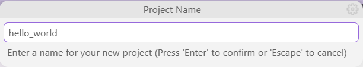

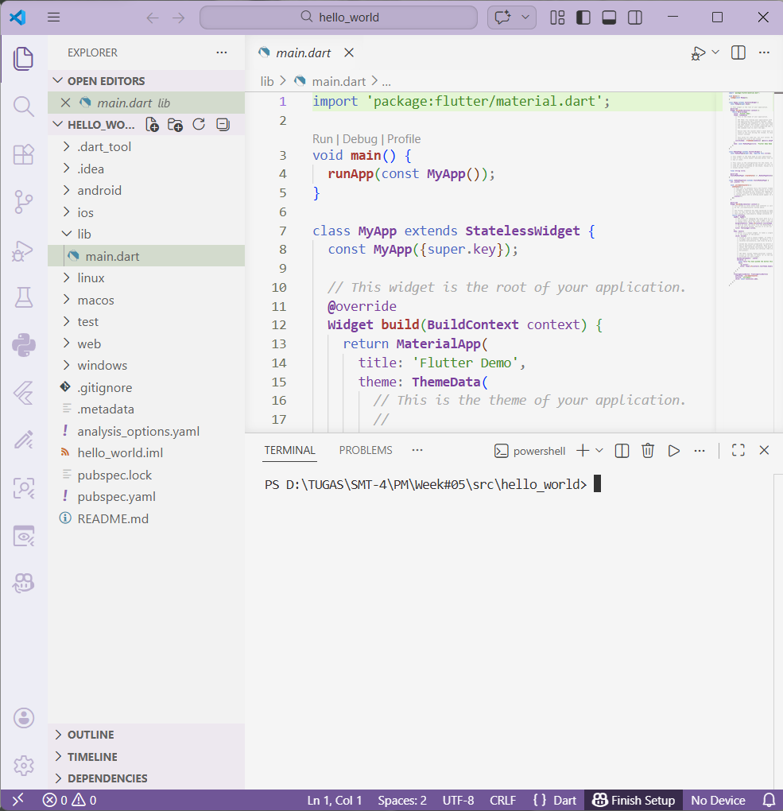

---

## Praktikum 2: Menghubungkan Perangkat Android atau Emulator

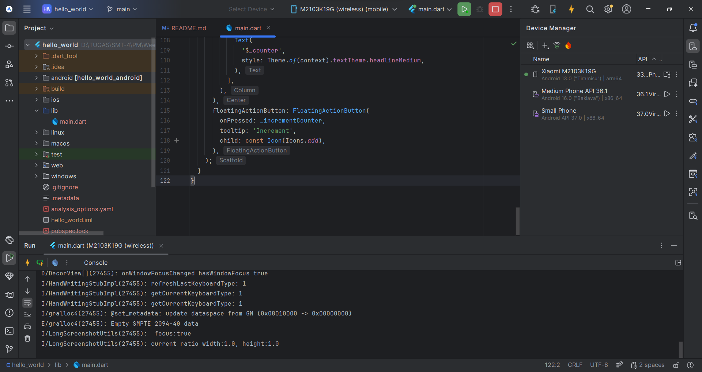

---

## Praktikm 3: Membuat Repository GitHub dan Laporan Praktikum

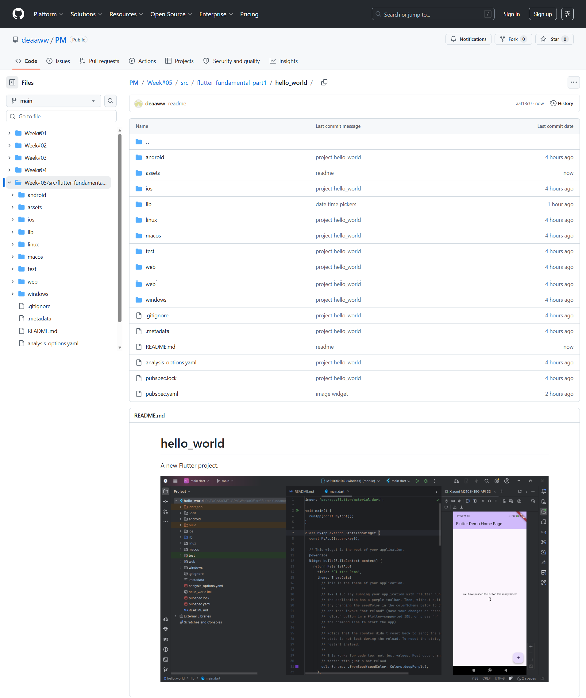


---

## Praktikum 4: Menerapkan Widget Dasar

### Langkah 1: Text Widget

File text_widget.dart
```
import 'package:flutter/material.dart';

class MyTextWidget extends StatelessWidget {
  const MyTextWidget({Key? key}) : super(key: key);

  @override
  Widget build(BuildContext context) {
    return const Text(
      "Nama saya Dea Marselia Rahma, sedang belajar Pemrograman Mobile",
      style: TextStyle(color: Colors.red, fontSize: 14),
      textAlign: TextAlign.center);
  }
}
```
Import ke main.dart dan ganti bagian text widget
```
import 'package:hello_world/basic_widgets/text_widget.dart';
```
```
          mainAxisAlignment: MainAxisAlignment.center,
          children: <Widget>[
            const MyTextWidget(),
```
Hasil Running

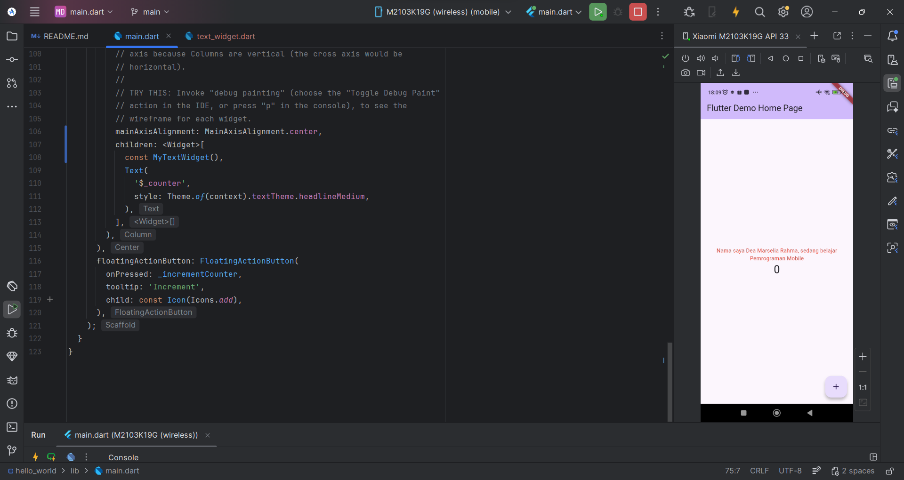

----

### Langkah 2: Image Widget

File image_widget.dart
```
import 'package:flutter/material.dart';

class MyImageWidget extends StatelessWidget {
  const MyImageWidget({Key? key}) : super(key: key);

  @override
  Widget build(BuildContext context) {
    return const Image(
      image: AssetImage("assets/logo_polinema.jpg")
    );
  }
}
```
Import ke main.dart dan ganti bagian image widget
```
import 'package:hello_world/basic_widgets/image_widget.dart';
```
```
          mainAxisAlignment: MainAxisAlignment.center,
          children: <Widget>[
            const MyImageWidget(),
            Text(
```
File pubspec.yaml
```
flutter:

  uses-material-design: true

  assets:
   - assets/logo_polinema.jpg
```
Hasil Running

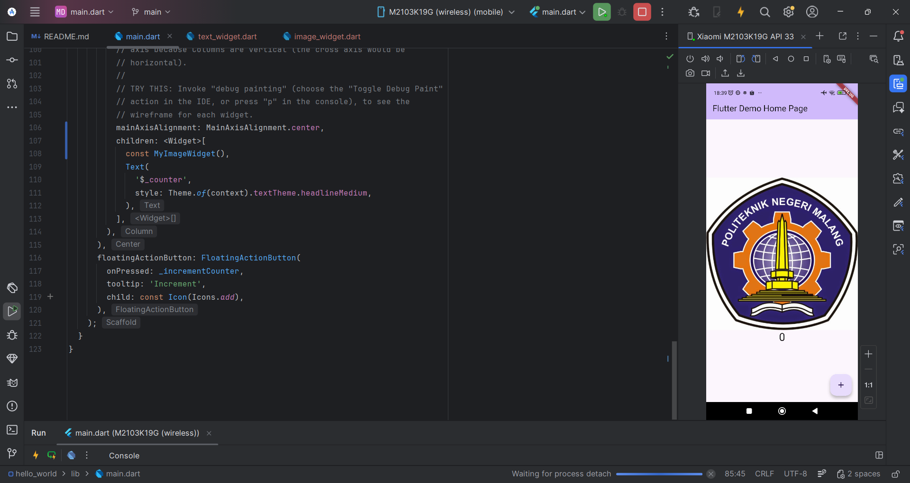

---

## Praktikum 5: Menerapkan Widget Material Design dan iOS Cupertino

### Langkah 1: Cupertino Button dan Loading Bar

File loading_cupertino.dart
```
import 'package:flutter/material.dart';
import 'package:flutter/cupertino.dart';

class MyWidget extends StatelessWidget {
  const MyWidget({super.key});

  @override
  Widget build(BuildContext context) {
    return MaterialApp(
      home: Container(
        margin: const EdgeInsets.only(top: 30),
        color: Colors.white,
        child: Column(
          children: <Widget>[
            CupertinoButton(
              child: const Text("Contoh button"),
              onPressed: () {},
            ),
            const CupertinoActivityIndicator(),
          ],
        ),
      ),
    );
  }
}
```
File main.dart
```
import 'package:flutter/material.dart';
import 'package:hello_world/basic_widgets/loading_cupertino.dart';

void main() {
  runApp(const MyWidget());
}
```
Hasil Running

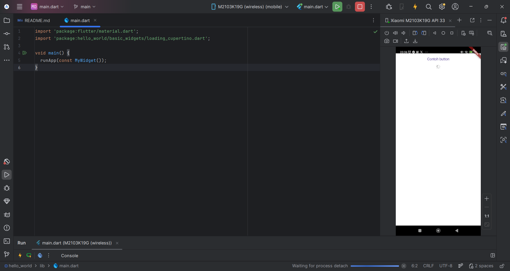

---

### Langkah 2: Floating Action Button (FAB)

File fab_widget.dart
```
import 'package:flutter/material.dart';

class MyWidget extends StatelessWidget {
  const MyWidget({super.key});

  @override
  Widget build(BuildContext context) {
    return MaterialApp(
      home: Scaffold(
        floatingActionButton: FloatingActionButton(
          onPressed: () {
            // Add your onPressed code here!
          },
          child: const Icon(Icons.thumb_up),
          backgroundColor: Colors.pink,
        ),
      ),
    );
  }
}
```
File main.dart
```
import 'package:flutter/material.dart';
import 'package:hello_world/basic_widgets/fab_widget.dart';

void main() {
  runApp(const MyWidget());
}
```
Hasil Running


---

### Langkah 3: Scaffold Widget

File main.dart
```
import 'package:flutter/material.dart';

void main() {
  runApp(const MyApp());
}

class MyApp extends StatelessWidget {
  const MyApp({Key? key}) : super(key: key);

  // This widget is the root of your application.
  @override
  Widget build(BuildContext context) {
    return MaterialApp(
      title: 'Flutter Demo',
      theme: ThemeData(
        primarySwatch: Colors.red,
      ),
      home: const MyHomePage(title: 'My Increment App'),
    );
  }
}

class MyHomePage extends StatefulWidget {
  const MyHomePage({Key? key, required this.title}) : super(key: key);

  final String title;

  @override
  State<MyHomePage> createState() => _MyHomePageState();
}

class _MyHomePageState extends State<MyHomePage> {
  int _counter = 0;

  void _incrementCounter() {
    setState(() {
      _counter++;
    });
  }

  @override
  Widget build(BuildContext context) {
    return Scaffold(
      appBar: AppBar(
        title: Text(widget.title),
      ),
      body: Center(
        child: Column(
          mainAxisAlignment: MainAxisAlignment.center,
          children: <Widget>[
            const Text(
              'You have pushed the button this many times:',
            ),
            Text(
              '$_counter',
              style: Theme.of(context).textTheme.headlineMedium,
            ),
          ],
        ),
      ),
      bottomNavigationBar: BottomAppBar(
        child: Container(
          height: 50.0,
        ),
      ),
      floatingActionButton: FloatingActionButton(
        onPressed: _incrementCounter,
        tooltip: 'Increment Counter',
        child: const Icon(Icons.add),
      ), 
      floatingActionButtonLocation: FloatingActionButtonLocation.centerDocked,
    );
  }
}
```
Hasil Running

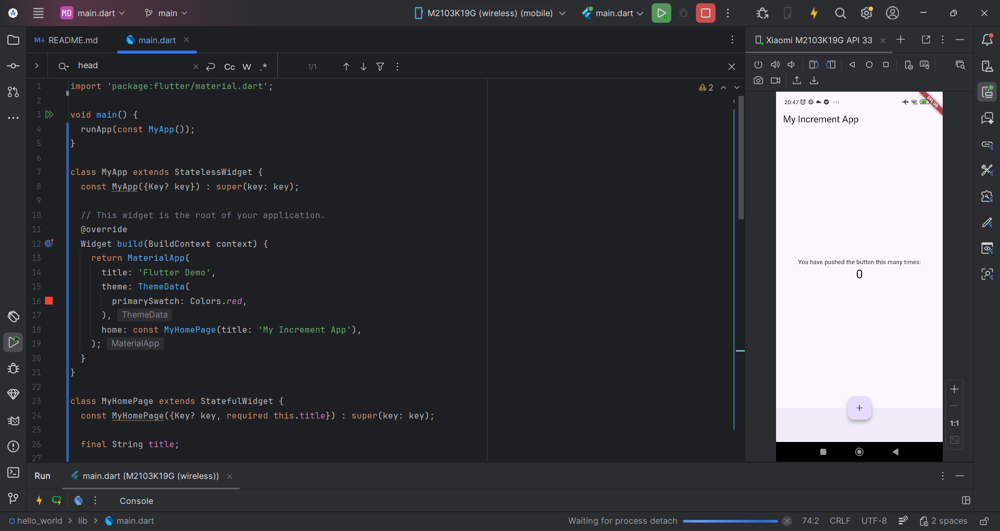

---

### Langkah 4: Dialog Widget

File main.dart
```
import 'package:flutter/material.dart';

void main() {
  runApp(const MyApp());
}

class MyApp extends StatelessWidget {
  const MyApp({Key? key}) : super(key: key);

  @override
  Widget build(BuildContext context) {
    return const MaterialApp(
      home: Scaffold(
        body: MyLayout(),
      ),
    );
  }
}

class MyLayout extends StatelessWidget {
  const MyLayout({Key? key}) : super(key: key);

  @override
  Widget build(BuildContext context) {
    return Padding(
      padding: const EdgeInsets.all(8.0),
      child: ElevatedButton(
        child: const Text('Show alert'),
        onPressed: () {
          showAlertDialog(context);
        },
      ),
    );
  }
}

showAlertDialog(BuildContext context) {
  // set up the button
  Widget okButton = TextButton(
    child: const Text("OK"),
    onPressed: () {
      Navigator.pop(context);
    },
  );

  // set up the AlertDialog
  AlertDialog alert = AlertDialog(
    title: const Text("My title"),
    content: const Text("This is my message."),
    actions: [
      okButton,
    ],
  );

  // show the dialog
  showDialog(
    context: context,
    builder: (BuildContext context) {
      return alert;
    },
  );
}
```
Hasil Running

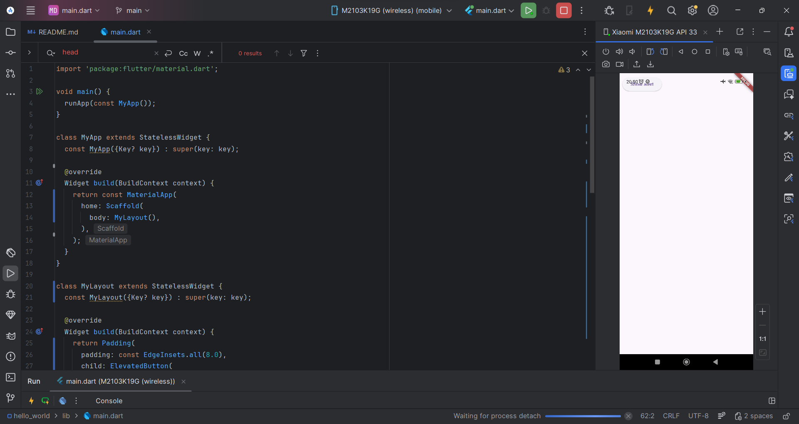

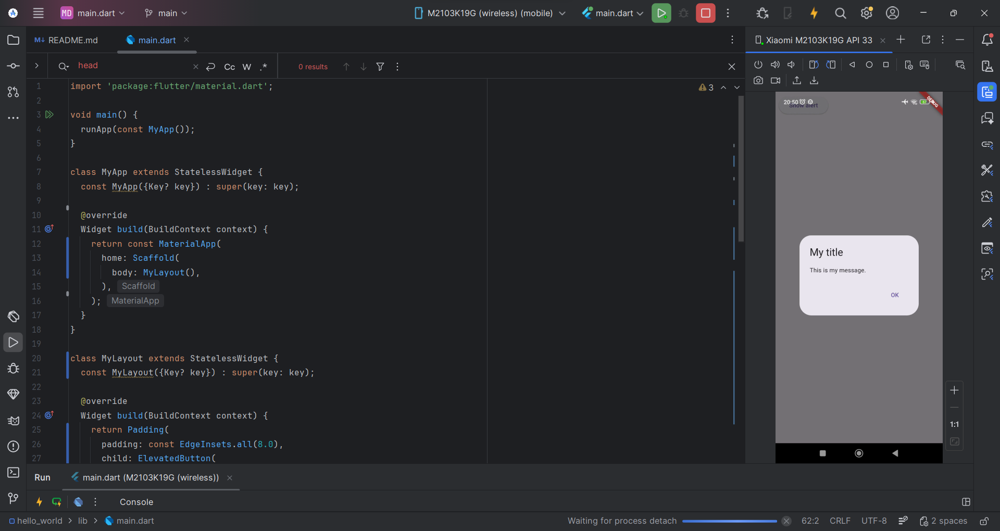

---

### Langkah 5: Input dan Selection Widget

File main.dart
```
import 'package:flutter/material.dart';

void main() {
  runApp(const MyApp());
}

class MyApp extends StatelessWidget {
  const MyApp({Key? key}) : super(key: key);

  @override
  Widget build(BuildContext context) {
    return MaterialApp(
      home: Scaffold(
        appBar: AppBar(title: const Text("Contoh TextField")),
        body: const TextField(
          obscureText: false,
          decoration: InputDecoration(
            border: OutlineInputBorder(),
            labelText: 'Nama',
          ),
        ),
      ),
    );
  }
}
```
Hasil Running

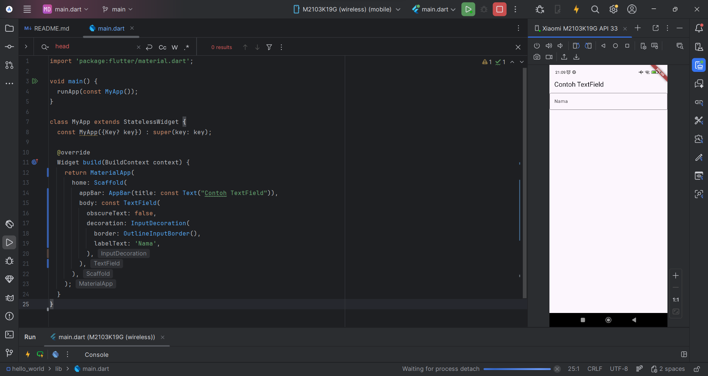

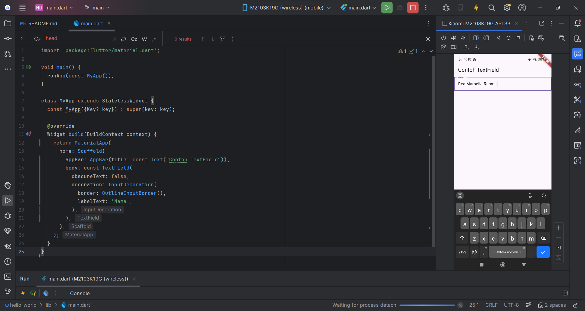

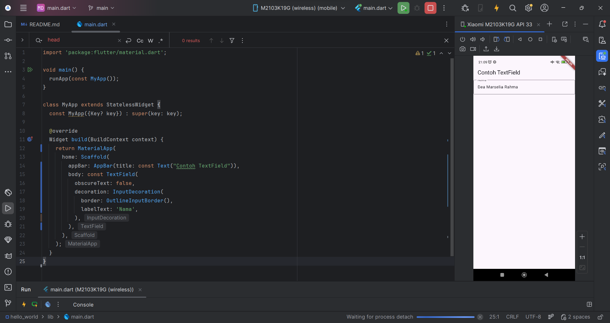

---

### Langkah 6: Date and Time Pickers

File main.dart
```
import 'dart:async';
import 'package:flutter/material.dart';

void main() => runApp(const MyApp());

class MyApp extends StatelessWidget {
  const MyApp({Key? key}) : super(key: key);

  @override
  Widget build(BuildContext context) {
    return const MaterialApp(
      title: 'Contoh Date Picker',
      home: MyHomePage(title: 'Contoh Date Picker'),
    );
  }
}

class MyHomePage extends StatefulWidget {
  const MyHomePage({Key? key, required this.title}) : super(key: key);

  final String title;

  @override
  _MyHomePageState createState() => _MyHomePageState();
}

class _MyHomePageState extends State<MyHomePage> {
  // Variable/State untuk mengambil tanggal
  DateTime selectedDate = DateTime.now();

  //  Initial SelectDate FLutter
  Future<void> _selectDate(BuildContext context) async {
    // Initial DateTime FIinal Picked
    final DateTime? picked = await showDatePicker(
        context: context,
        initialDate: selectedDate,
        firstDate: DateTime(2015, 8),
        lastDate: DateTime(2101));
    if (picked != null && picked != selectedDate) {
      setState(() {
        selectedDate = picked;
      });
    }
  }

  @override
  Widget build(BuildContext context) {
    return Scaffold(
      appBar: AppBar(
        title: Text(widget.title),
      ),
      body: Center(
        child: Column(
          mainAxisSize: MainAxisSize.min,
          children: <Widget>[
            Text("${selectedDate.toLocal()}".split(' ')[0]),
            const SizedBox(
              height: 20.0,
            ),
            ElevatedButton(
              onPressed: () => {
                _selectDate(context),
                // ignore: avoid_print
                print(selectedDate.day + selectedDate.month + selectedDate.year)
              },
              child: const Text('Pilih Tanggal'),
            ),
          ],
        ),
      ),
    );
  }
}
```
Hasil Running

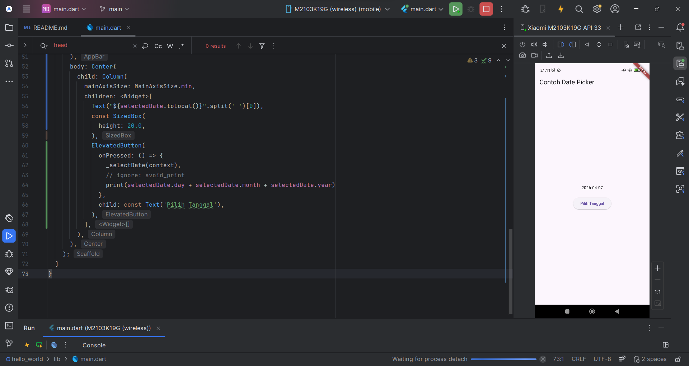

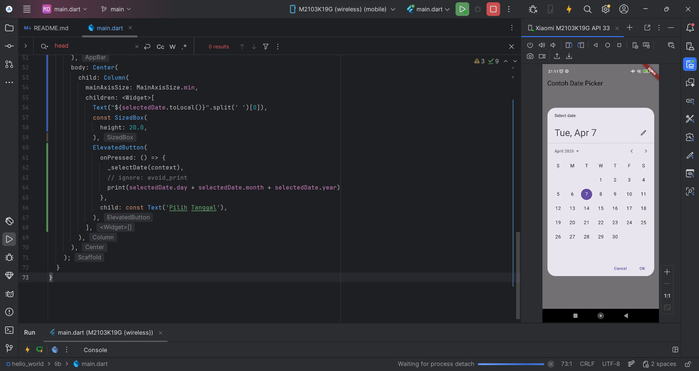

---