# 05 | Aplikasi Pertama dan Widget Dasar Flutter

## Identitas Mahasiswa 

| Atribut | Nilai               |
| ------- | --------------------|
| Nama    | Dea Marselia Rahma  |
| NIM     | 244107060087        |
| Kelas   | SIB 2F              |

---

## Project Namer_App

File `pubspec.yaml`.
```
name: namer_app
description: A new Flutter project.

publish_to: 'none' # Remove this line if you wish to publish to pub.dev

version: 0.0.1+1

environment:
  sdk: '>=2.19.4 <4.0.0'

dependencies:
  flutter:
    sdk: flutter

  english_words: ^4.0.0
  provider: ^6.0.0

dev_dependencies:
  flutter_test:
    sdk: flutter

  flutter_lints: ^2.0.0

flutter:
  uses-material-design: true
```

File `analysis_options.yaml`.
```
include: package:flutter_lints/flutter.yaml

linter:
  rules:
    prefer_const_constructors: false
    prefer_final_fields: false
    use_key_in_widget_constructors: false
    prefer_const_literals_to_create_immutables: false
    prefer_const_constructors_in_immutables: false
    avoid_print: false
```

File `main.dart`.
```
import 'package:english_words/english_words.dart';
import 'package:flutter/material.dart';
import 'package:provider/provider.dart';

void main() {
  runApp(MyApp());
}

class MyApp extends StatelessWidget {
  const MyApp({super.key});

  @override
  Widget build(BuildContext context) {
    return ChangeNotifierProvider(
      create: (context) => MyAppState(),
      child: MaterialApp(
        title: 'Namer App',
        theme: ThemeData(
          useMaterial3: true,
          colorScheme: ColorScheme.fromSeed(seedColor: Colors.deepOrange),
        ),
        home: MyHomePage(),
      ),
    );
  }
}

class MyAppState extends ChangeNotifier {
  var current = WordPair.random();
}

class MyHomePage extends StatelessWidget {
  @override
  Widget build(BuildContext context) {
    var appState = context.watch<MyAppState>();

    return Scaffold(
      body: Column(
        children: [
          Text('A random idea:'),
          Text(appState.current.asLowerCase),
        ],
      ),
    );
  }
}
```
---

## Menambahkan Tombol

### Meluncurkan Aplikasi

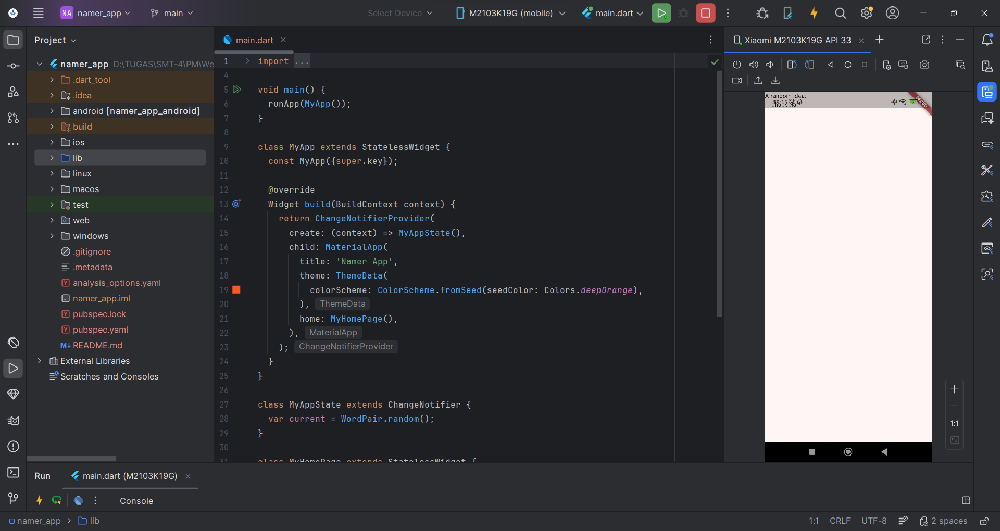

---

### Hot Reload Pertama

File `main.dart` tambahkan sesuatu pada string di objek `Text` pertama.
```
    return Scaffold(
      body: Column(
        children: [
          Text('A random AWESOME idea:'),  // ← Example change.
          Text(appState.current.asLowerCase),
        ],
      ),
    );
```

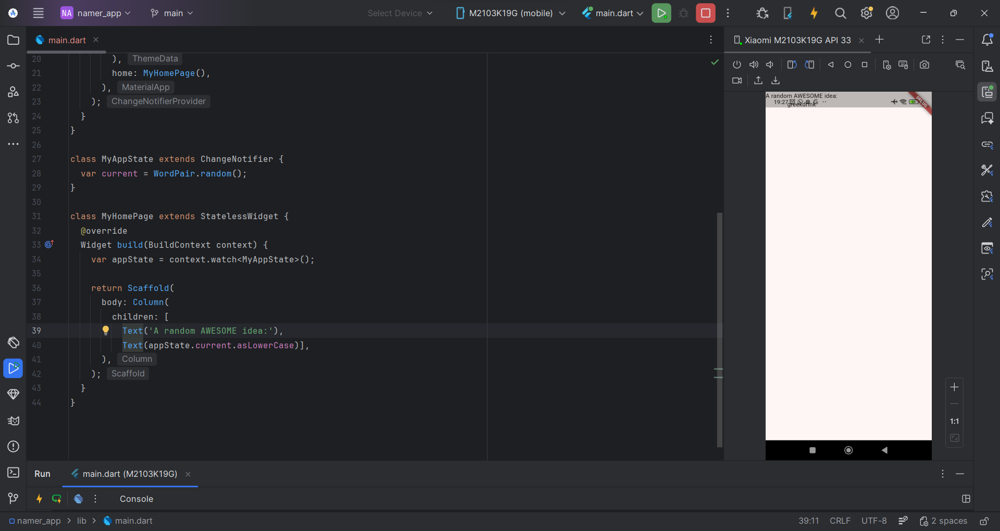

---

### Menambahkan tombol

File `main.dart` tambahkan tombol di bagian bawah `Column`, tepat di bawah instance `Text` kedua.
```
    return Scaffold(
      body: Column(
        children: [
          Text('A random AWESOME idea:'),
          Text(appState.current.asLowerCase),

          // ↓ Add this.
          ElevatedButton(
            onPressed: () {
              print('button pressed!');
            },
            child: Text('Next'),
          ),

        ],
      ),
    );
```

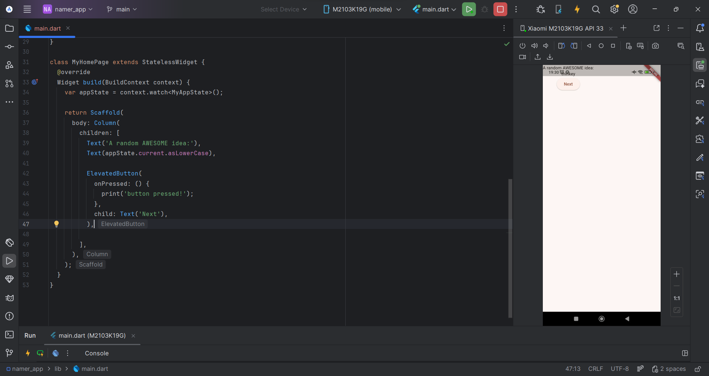

---

Scroll ke `MyAppState` lalu tambahkan metode `getNext`.
```
class MyAppState extends ChangeNotifier {
  var current = WordPair.random();

  // ↓ Add this.
  void getNext() {
    current = WordPair.random();
    notifyListeners();
  }
}
```

Memanggil metode getNext dari callback tombol tersebut.
```
    ElevatedButton(
      onPressed: () {
        appState.getNext();  // ← This instead of print().
      },
      child: Text('Next'),
    ),
```

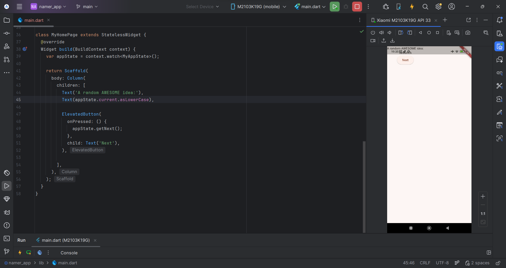

Aplikasi akan menghasilkan pasangan kata acak baru setiap menekan tombol **Next**.

---

## Memperindah Tampilan Aplikasi

### Mengekstrak Widget

Tulis ulang widget `MyHomePage`.
```
class MyHomePage extends StatelessWidget {
  @override
  Widget build(BuildContext context) {
    var appState = context.watch<MyAppState>();
    var pair = appState.current;                 // ← Add this.

    return Scaffold(
      body: Column(
        children: [
          Text('A random AWESOME idea:'),
          Text(pair.asLowerCase),                // ← Change to this.
          ElevatedButton(
            onPressed: () {
              appState.getNext();
            },
            child: Text('Next'),
          ),
        ],
      ),
    );
  }
}
```
Klik kanan `Text` pilih **Refactor**, pilih **Extract Widget**. Tetapkan nama **BigCard**.

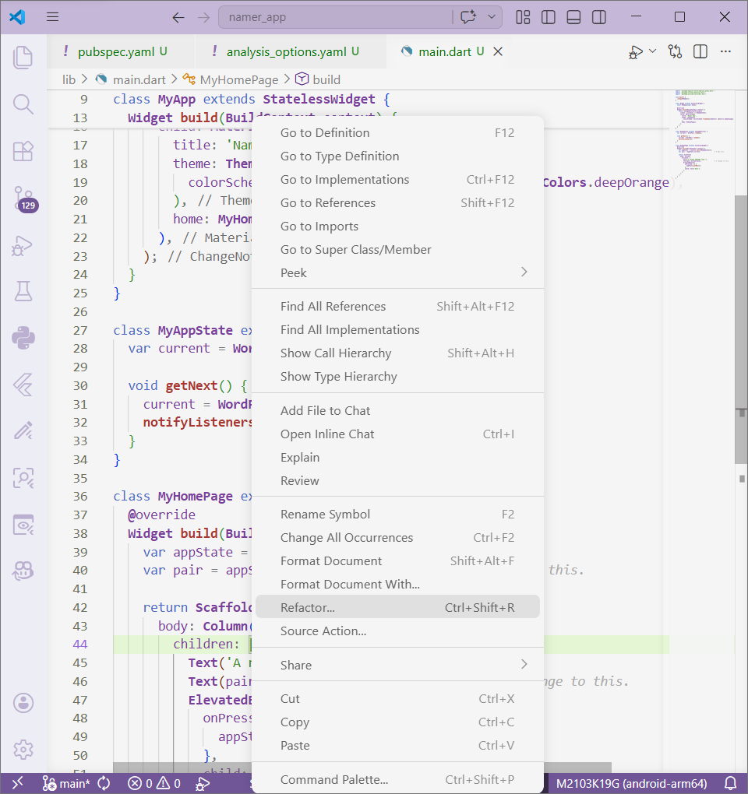

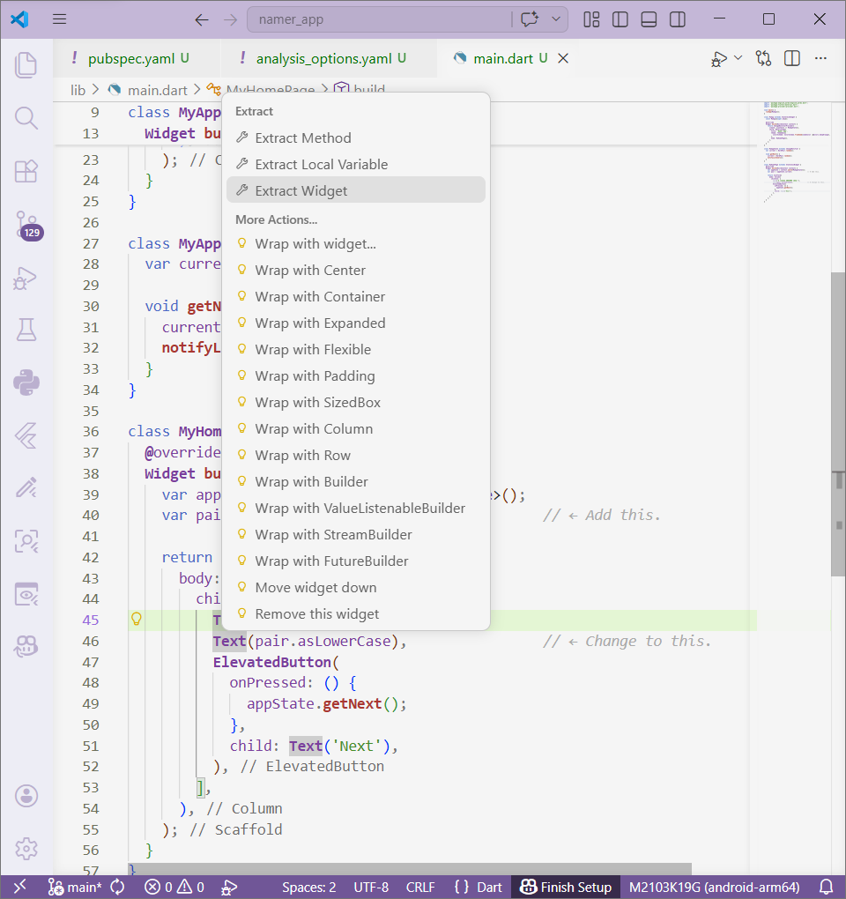

```
class BigCard extends StatelessWidget {
  const BigCard({
    super.key,
    required this.pair,
  });

  final WordPair pair;

  @override
  Widget build(BuildContext context) {
    return Text(pair.asLowerCase);
  }
}
```

---

### Menambahkan Kartu

Class `BigCard` metode `build()` panggil **Refactor** pada widget `Text`. Pilih **Wrap with Padding** yang akan menciptakan widget induk baru di sekitar widget `Text` bernama `Padding`. Tingkatkan nilai padding ke `20`.

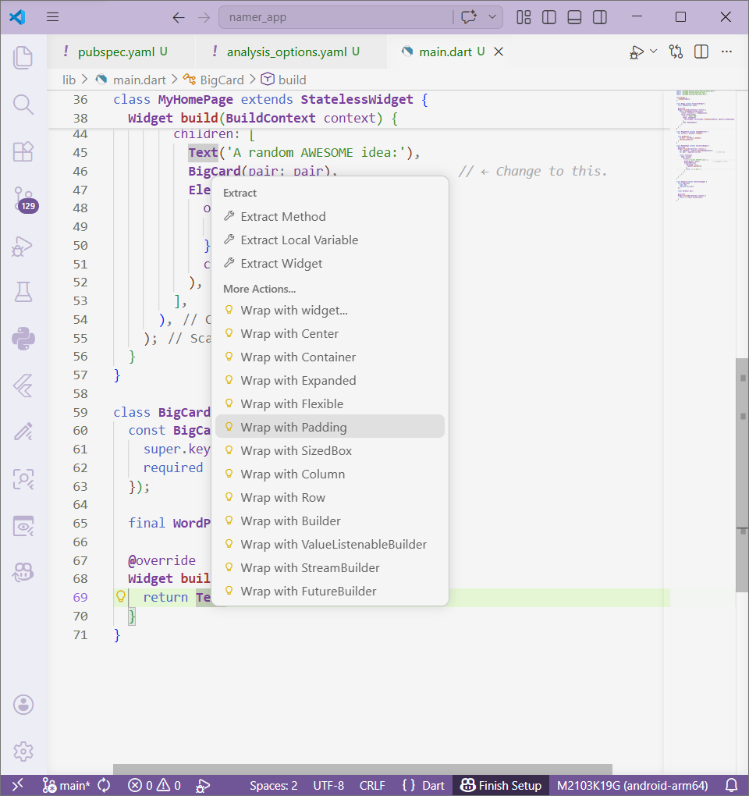

Pada widget `Padding` panggil **Refactor**, pilih **Wrap with widget**. Ketik "Card".

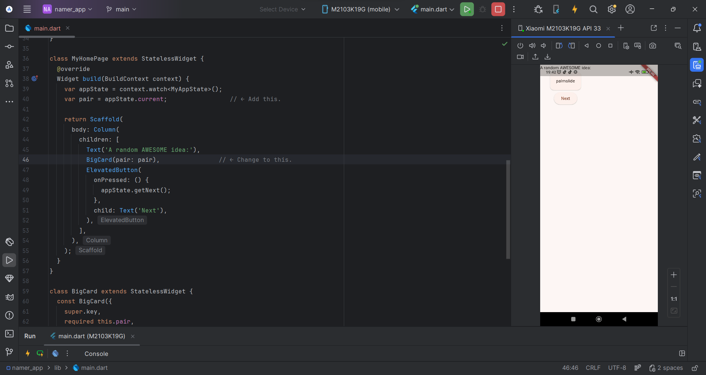

---

### Tema dan Gaya

Metode `build()` `BigCard`.
```
  @override
  Widget build(BuildContext context) {
    final theme = Theme.of(context);       // ← Add this.

    return Card(
      color: theme.colorScheme.primary,    // ← And also this.
      child: Padding(
        padding: const EdgeInsets.all(20),
        child: Text(pair.asLowerCase),
      ),
    );
  }
```

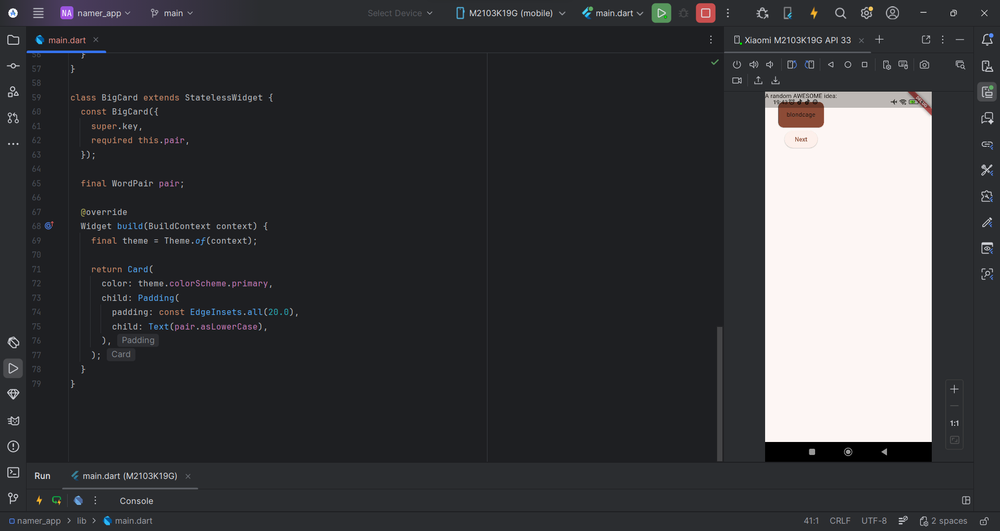

Bisa mengubah warna dengan scroll `MyApp` dan ubah warna seed untuk `ColorSheme`.

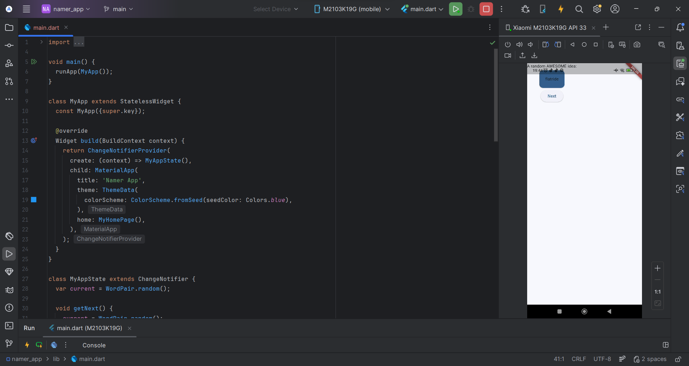

---

### TextTheme

Metode `build()` `BigCard`.
```
  @override
  Widget build(BuildContext context) {
    final theme = Theme.of(context);
    // ↓ Add this.
    final style = theme.textTheme.displayMedium!.copyWith(
      color: theme.colorScheme.onPrimary,
    );

    return Card(
      color: theme.colorScheme.primary,
      child: Padding(
        padding: const EdgeInsets.all(20),
        // ↓ Change this line.
        child: Text(pair.asLowerCase, style: style),
      ),
    );
  }
```

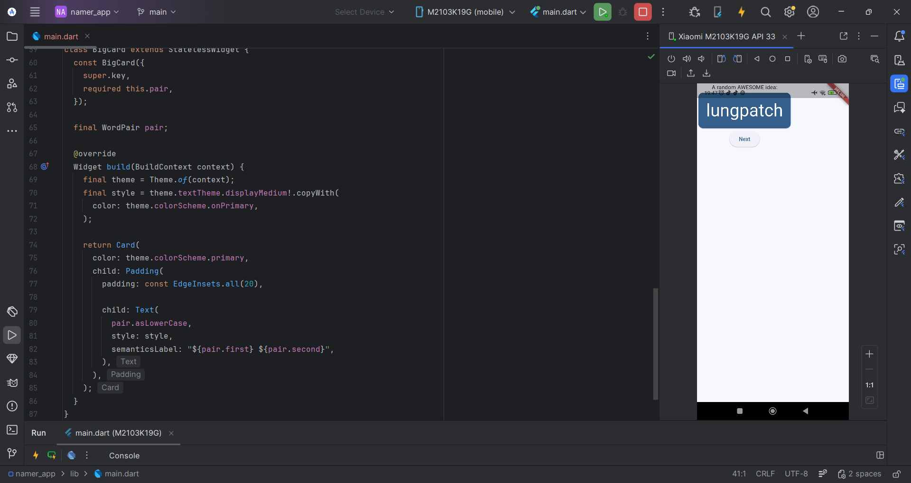

---

### Meningkatkan Aksesibilitas

Properti `semanticsLabel` `Text`.
```
  @override
  Widget build(BuildContext context) {
    final theme = Theme.of(context);
    final style = theme.textTheme.displayMedium!.copyWith(
      color: theme.colorScheme.onPrimary,
    );

    return Card(
      color: theme.colorScheme.primary,
      child: Padding(
        padding: const EdgeInsets.all(20),

        // ↓ Make the following change.
        child: Text(
          pair.asLowerCase,
          style: style,
          semanticsLabel: "${pair.first} ${pair.second}",
        ),
      ),
    );
  }
```

---

### Menempatkan UI di Tengah

Metode `build()` `MyHomePage`.
```
class MyHomePage extends StatelessWidget {
  @override
  Widget build(BuildContext context) {
    var appState = context.watch<MyAppState>();
    var pair = appState.current;

    return Scaffold(
      body: Column(
        mainAxisAlignment: MainAxisAlignment.center,  // ← Add this.
        children: [
          Text('A random AWESOME idea:'),
          BigCard(pair: pair),
          ElevatedButton(
            onPressed: () {
              appState.getNext();
            },
            child: Text('Next'),
          ),
        ],
      ),
    );
  }
}
```

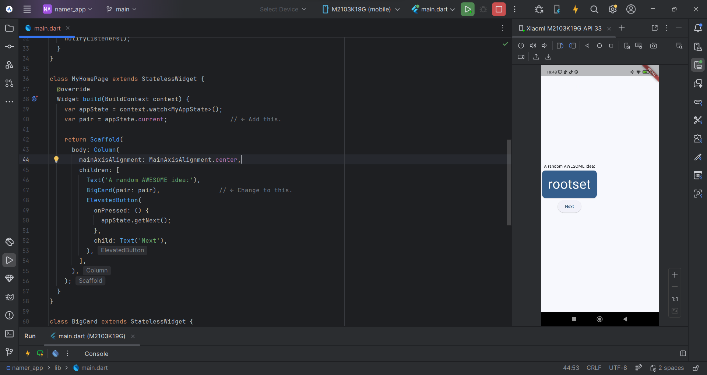

Kursor di `Column` buka **Refactor**, pilih **Wrap with Center**.

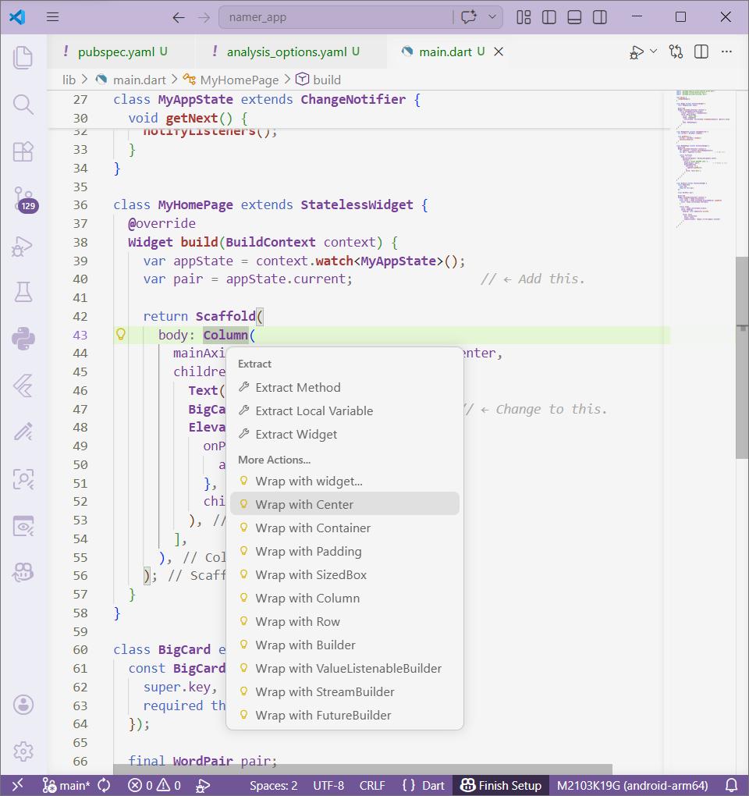

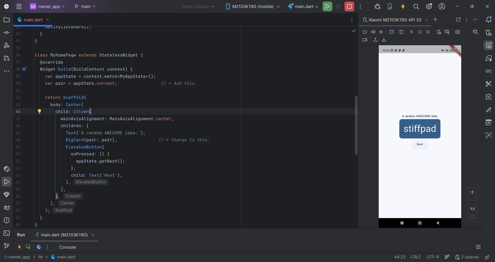

`MyHomePage`.

```
class MyHomePage extends StatelessWidget {
  @override
  Widget build(BuildContext context) {
    var appState = context.watch<MyAppState>();
    var pair = appState.current;

    return Scaffold(
      body: Center(
        child: Column(
          mainAxisAlignment: MainAxisAlignment.center,
          children: [
            BigCard(pair: pair),
            SizedBox(height: 10),
            ElevatedButton(
              onPressed: () {
                appState.getNext();
              },
              child: Text('Next'),
            ),
          ],
        ),
      ),
    );
  }
}
```
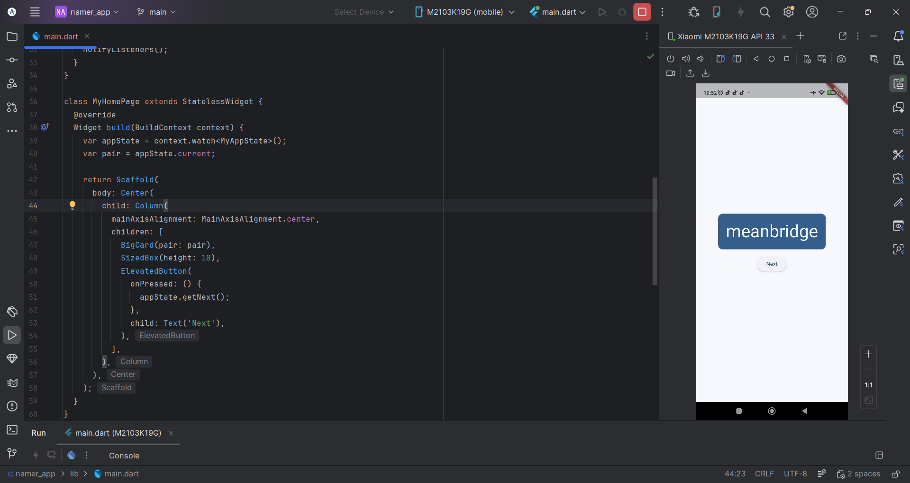

---

## Menambahkan Fungsi

### Menambahkan Logika Bisnis

Scroll `MyAppState`.
```
class MyAppState extends ChangeNotifier {
  var current = WordPair.random();

  void getNext() {
    current = WordPair.random();
    notifyListeners();
  }

  // ↓ Add the code below.
  var favorites = <WordPair>[];

  void toggleFavorite() {
    if (favorites.contains(current)) {
      favorites.remove(current);
    } else {
      favorites.add(current);
    }
    notifyListeners();
  }
}
```

### Menambahkan Tombol

`build()` `MyHomePage`, kursor pada `ElevatedButton`. Buka **Refactor**, pilih **Wrap with Row**.

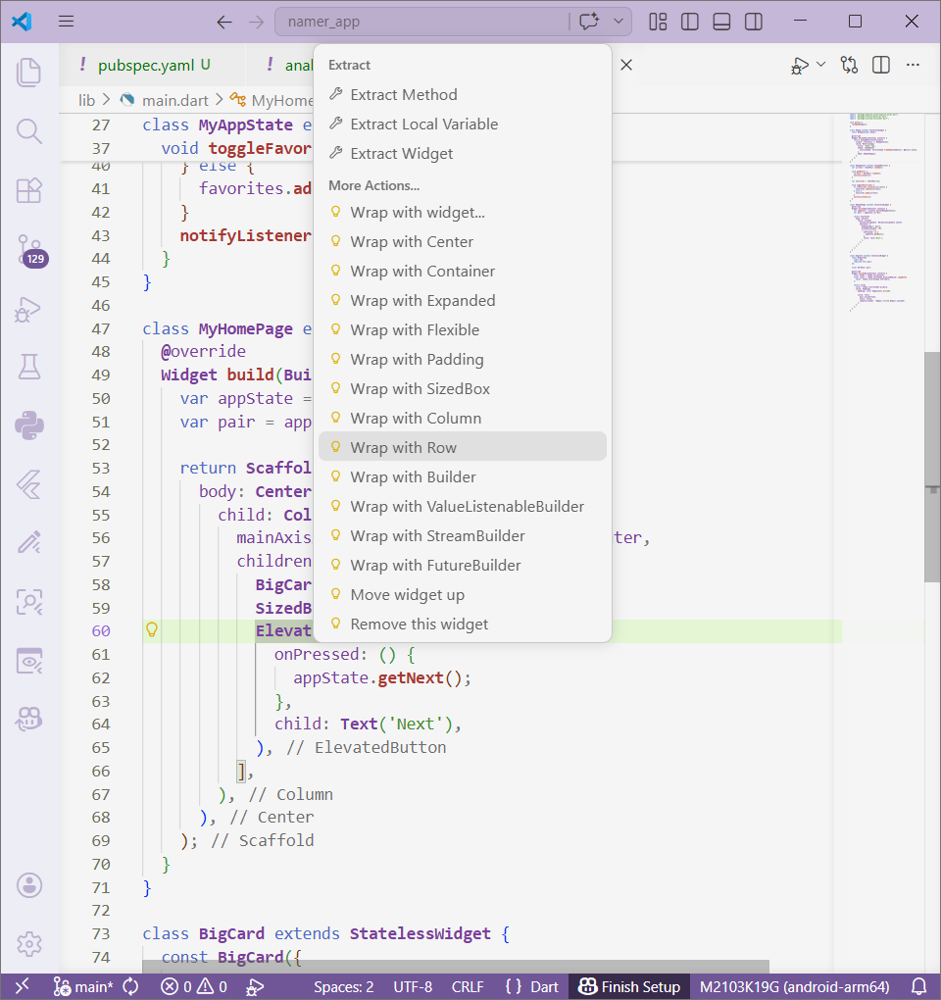

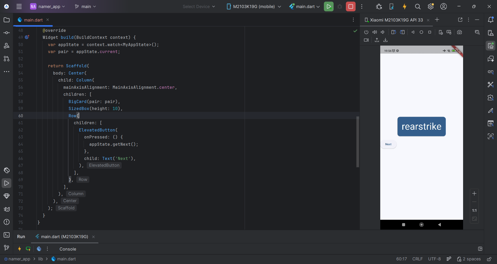

```
class MyHomePage extends StatelessWidget {
  @override
  Widget build(BuildContext context) {
    var appState = context.watch<MyAppState>();
    var pair = appState.current;

    return Scaffold(
      body: Center(
        child: Column(
          mainAxisAlignment: MainAxisAlignment.center,
          children: [
            BigCard(pair: pair),
            SizedBox(height: 10),
            Row(
              mainAxisSize: MainAxisSize.min,   // ← Add this.
              children: [
                ElevatedButton(
                  onPressed: () {
                    appState.getNext();
                  },
                  child: Text('Next'),
                ),
              ],
            ),
          ],
        ),
      ),
    );
  }
}
```

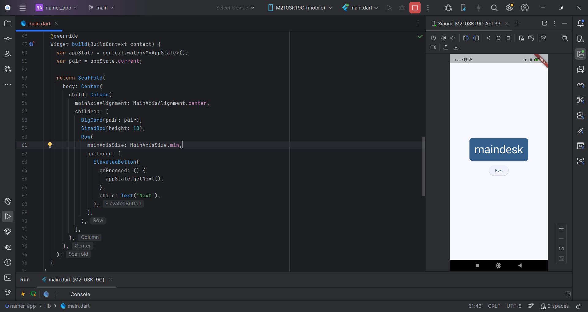

Menambahkan tombol kedua `MyHomePage`. Konstruktor `ElevatedButton.icon()` untuk membuat tombol dengan ikon. Di bagian atas metode `build`. Penggunaan `SizedBox` untuk menjaga jarak antara kedua tombol.

```
class MyHomePage extends StatelessWidget {
  @override
  Widget build(BuildContext context) {
    var appState = context.watch<MyAppState>();
    var pair = appState.current;

    // ↓ Add this.
    IconData icon;
    if (appState.favorites.contains(pair)) {
      icon = Icons.favorite;
    } else {
      icon = Icons.favorite_border;
    }

    return Scaffold(
      body: Center(
        child: Column(
          mainAxisAlignment: MainAxisAlignment.center,
          children: [
            BigCard(pair: pair),
            SizedBox(height: 10),
            Row(
              mainAxisSize: MainAxisSize.min,
              children: [

                // ↓ And this.
                ElevatedButton.icon(
                  onPressed: () {
                    appState.toggleFavorite();
                  },
                  icon: Icon(icon),
                  label: Text('Like'),
                ),
                SizedBox(width: 10),

                ElevatedButton(
                  onPressed: () {
                    appState.getNext();
                  },
                  child: Text('Next'),
                ),
              ],
            ),
          ],
        ),
      ),
    );
  }
}
```

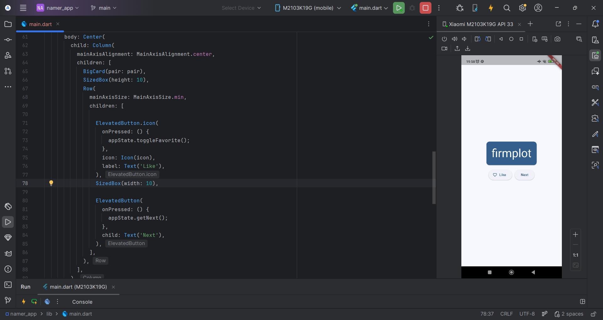

---

## Menambahkan Kolom Samping Navigasi

`MyHomePage`.
```
class MyHomePage extends StatelessWidget {
  @override
  Widget build(BuildContext context) {
    return Scaffold(
      body: Row(
        children: [
          SafeArea(
            child: NavigationRail(
              extended: false,
              destinations: [
                NavigationRailDestination(
                  icon: Icon(Icons.home),
                  label: Text('Home'),
                ),
                NavigationRailDestination(
                  icon: Icon(Icons.favorite),
                  label: Text('Favorites'),
                ),
              ],
              selectedIndex: 0,
              onDestinationSelected: (value) {
                print('selected: $value');
              },
            ),
          ),
          Expanded(
            child: Container(
              color: Theme.of(context).colorScheme.primaryContainer,
              child: GeneratorPage(),
            ),
          ),
        ],
      ),
    );
  }
}

class GeneratorPage extends StatelessWidget {
  @override
  Widget build(BuildContext context) {
    var appState = context.watch<MyAppState>();
    var pair = appState.current;

    IconData icon;
    if (appState.favorites.contains(pair)) {
      icon = Icons.favorite;
    } else {
      icon = Icons.favorite_border;
    }

    return Center(
      child: Column(
        mainAxisAlignment: MainAxisAlignment.center,
        children: [
          BigCard(pair: pair),
          SizedBox(height: 10),
          Row(
            mainAxisSize: MainAxisSize.min,
            children: [
              ElevatedButton.icon(
                onPressed: () {
                  appState.toggleFavorite();
                },
                icon: Icon(icon),
                label: Text('Like'),
              ),
              SizedBox(width: 10),
              ElevatedButton(
                onPressed: () {
                  appState.getNext();
                },
                child: Text('Next'),
              ),
            ],
          ),
        ],
      ),
    );
  }
}
```

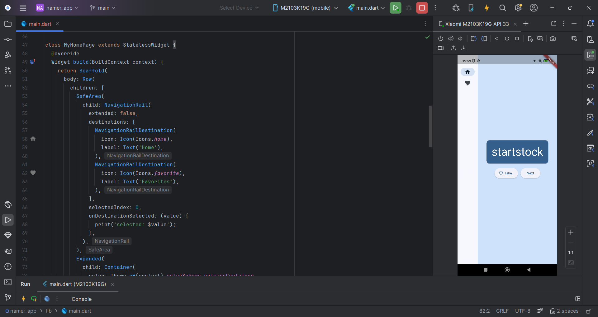

Ubah `extended: false` pada `NavigationRail` menjadi `True`.

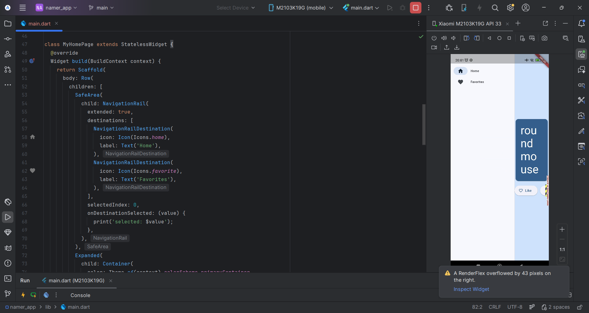

---

### Widget Stateless VS stateful

Tambahkan `selectedIndex` sebagai properti tambahan `MyAppState`.
```
class MyAppState extends ChangeNotifier {
  var current = WordPair.random();
  var favorites = <WordPair>[];
  var selectedIndex = 0;
  var selectedIndexInAnotherWidget = 0;
  var indexInYetAnotherWidget = 42;
  var optionASelected = false;
  var optionBSelected = false;
  var loadingFromNetwork = false;
```

Kursordi baris pertama `MyHomePage`, buka **Refactor**. Pilih **Convert to StatefulWidget**.

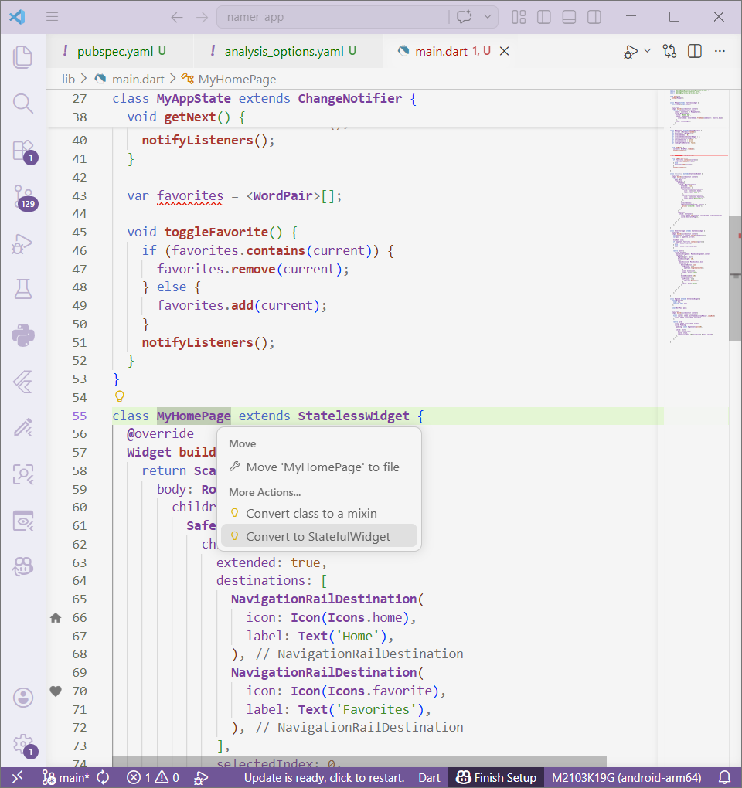

---

### setState

`_MyHomePageState` menambahkan variabel `selectedIndex`.
```
class _MyHomePageState extends State<MyHomePage> {

  var selectedIndex = 0;     // ← Add this property.

  @override
  Widget build(BuildContext context) {
    return Scaffold(
      body: Row(
        children: [
          SafeArea(
            child: NavigationRail(
              extended: false,
              destinations: [
                NavigationRailDestination(
                  icon: Icon(Icons.home),
                  label: Text('Home'),
                ),
                NavigationRailDestination(
                  icon: Icon(Icons.favorite),
                  label: Text('Favorites'),
                ),
              ],
              selectedIndex: selectedIndex,    // ← Change to this.
              onDestinationSelected: (value) {

                // ↓ Replace print with this.
                setState(() {
                  selectedIndex = value;
                });

              },
            ),
          ),
          Expanded(
            child: Container(
              color: Theme.of(context).colorScheme.primaryContainer,
              child: GeneratorPage(),
            ),
          ),
        ],
      ),
    );
  }
}
```

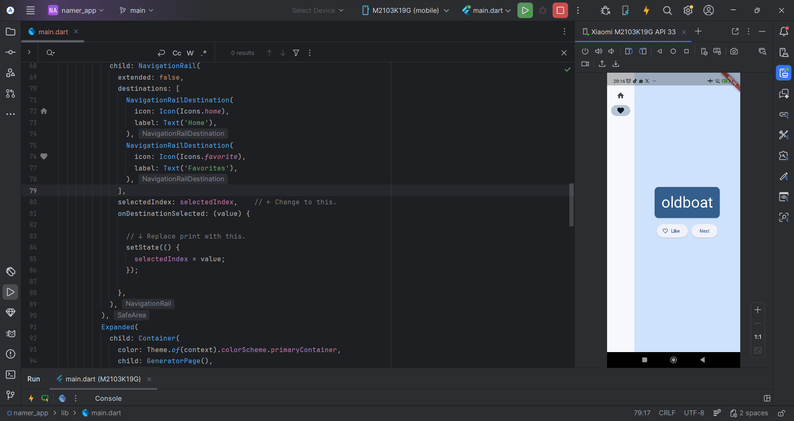

---

### Menggunakan selectedIndex

Metode `build` `_MyHomePageState`, tepat sebelum `return Scaffold`.
```
Widget page;
switch (selectedIndex) {
  case 0:
    page = GeneratorPage();
    break;
  case 1:
    page = Placeholder();
    break;
  default:
    throw UnimplementedError('no widget for $selectedIndex');
}
```

`_MyHomePageState`.

```
class _MyHomePageState extends State<MyHomePage> {
  var selectedIndex = 0;

  @override
  Widget build(BuildContext context) {
    Widget page;
    switch (selectedIndex) {
      case 0:
        page = GeneratorPage();
        break;
      case 1:
        page = Placeholder();
        break;
      default:
        throw UnimplementedError('no widget for $selectedIndex');
    }

    return Scaffold(
      body: Row(
        children: [
          SafeArea(
            child: NavigationRail(
              extended: false,
              destinations: [
                NavigationRailDestination(
                  icon: Icon(Icons.home),
                  label: Text('Home'),
                ),
                NavigationRailDestination(
                  icon: Icon(Icons.favorite),
                  label: Text('Favorites'),
                ),
              ],
              selectedIndex: selectedIndex,
              onDestinationSelected: (value) {
                setState(() {
                  selectedIndex = value;
                });
              },
            ),
          ),
          Expanded(
            child: Container(
              color: Theme.of(context).colorScheme.primaryContainer,
              child: page,  // ← Here.
            ),
          ),
        ],
      ),
    );
  }
}
```

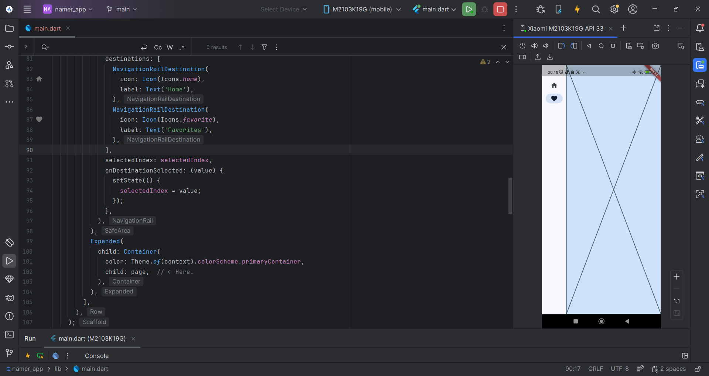

---

### Tingkat Respons

Metode `build` `_MyHomePageState`, kursor pada `Scaffold`. Buka **Refactor**, pilih **Wrap with Builder**. Modifikasi nama `Builder` menjadi `LayoutBuilder`. Modifikasi daftar parameter callback dari `(context)` menjadi `(context, constraints)`.

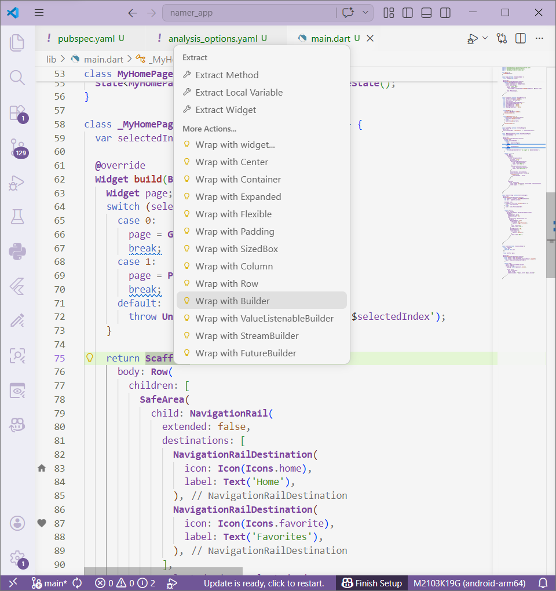

Metode `build` `_MyHomePageState`.
```
class _MyHomePageState extends State<MyHomePage> {
  var selectedIndex = 0;

  @override
  Widget build(BuildContext context) {
    Widget page;
    switch (selectedIndex) {
      case 0:
        page = GeneratorPage();
        break;
      case 1:
        page = Placeholder();
        break;
      default:
        throw UnimplementedError('no widget for $selectedIndex');
    }

    return LayoutBuilder(builder: (context, constraints) {
      return Scaffold(
        body: Row(
          children: [
            SafeArea(
              child: NavigationRail(
                extended: constraints.maxWidth >= 600,  // ← Here.
                destinations: [
                  NavigationRailDestination(
                    icon: Icon(Icons.home),
                    label: Text('Home'),
                  ),
                  NavigationRailDestination(
                    icon: Icon(Icons.favorite),
                    label: Text('Favorites'),
                  ),
                ],
                selectedIndex: selectedIndex,
                onDestinationSelected: (value) {
                  setState(() {
                    selectedIndex = value;
                  });
                },
              ),
            ),
            Expanded(
              child: Container(
                color: Theme.of(context).colorScheme.primaryContainer,
                child: page,
              ),
            ),
          ],
        ),
      );
    });
  }
}
```


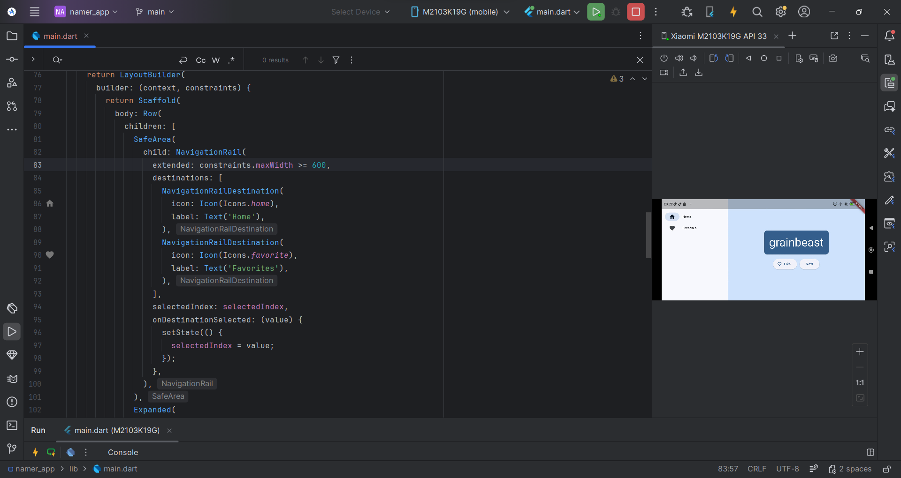

---

## Menambahkan Halaman Baru

Class `FavoritesPage`.
```
class FavoritesPage extends StatelessWidget {
  @override
  Widget build(BuildContext context) {
    var appState = context.watch<MyAppState>();

    if (appState.favorites.isEmpty) {
      return Center(
        child: Text('No favorites yet.'),
      );
    }

    return ListView(
      children: [
        Padding(
          padding: const EdgeInsets.all(20),
          child: Text('You have '
              '${appState.favorites.length} favorites:'),
        ),
        for (var pair in appState.favorites)
          ListTile(
            leading: Icon(Icons.favorite),
            title: Text(pair.asLowerCase),
          ),
      ],
    );
  }
}
```

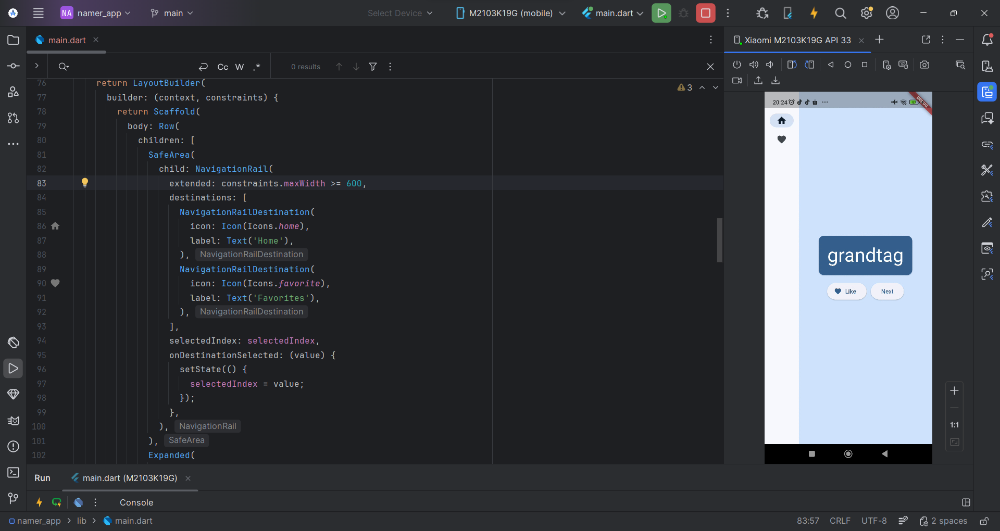

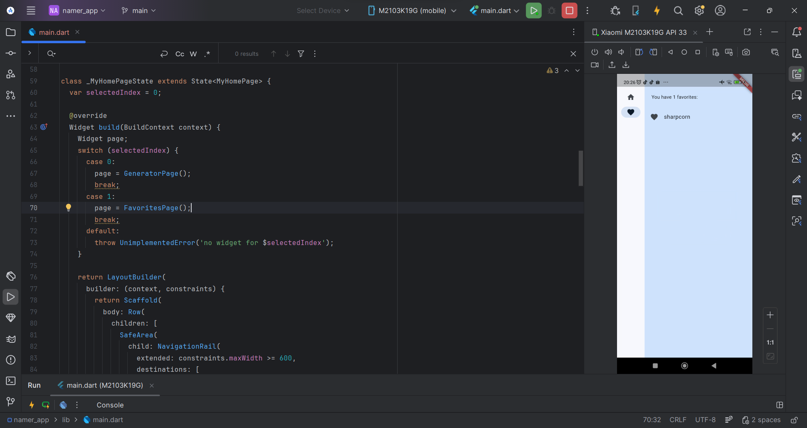

---

## Kode Versi Lanjutan

```
// ignore_for_file: prefer_const_constructors, prefer_const_literals_to_create_immutables

import 'package:english_words/english_words.dart';
import 'package:flutter/material.dart';
import 'package:provider/provider.dart';

void main() {
  runApp(MyApp());
}

class MyApp extends StatelessWidget {
  const MyApp({super.key});

  @override
  Widget build(BuildContext context) {
    return ChangeNotifierProvider(
      create: (context) => MyAppState(),
      child: MaterialApp(
        title: 'Namer App',
        theme: ThemeData(
          useMaterial3: true,
          colorScheme: ColorScheme.fromSeed(seedColor: Colors.deepOrange),
        ),
        home: MyHomePage(),
      ),
    );
  }
}

class MyAppState extends ChangeNotifier {
  var current = WordPair.random();
  var history = <WordPair>[];

  GlobalKey? historyListKey;

  void getNext() {
    history.insert(0, current);
    var animatedList = historyListKey?.currentState as AnimatedListState?;
    animatedList?.insertItem(0);
    current = WordPair.random();
    notifyListeners();
  }

  var favorites = <WordPair>[];

  void toggleFavorite([WordPair? pair]) {
    pair = pair ?? current;
    if (favorites.contains(pair)) {
      favorites.remove(pair);
    } else {
      favorites.add(pair);
    }
    notifyListeners();
  }

  void removeFavorite(WordPair pair) {
    favorites.remove(pair);
    notifyListeners();
  }
}

class MyHomePage extends StatefulWidget {
  @override
  State<MyHomePage> createState() => _MyHomePageState();
}

class _MyHomePageState extends State<MyHomePage> {
  var selectedIndex = 0;

  @override
  Widget build(BuildContext context) {
    var colorScheme = Theme.of(context).colorScheme;

    Widget page;
    switch (selectedIndex) {
      case 0:
        page = GeneratorPage();
        break;
      case 1:
        page = FavoritesPage();
        break;
      default:
        throw UnimplementedError('no widget for $selectedIndex');
    }

    // The container for the current page, with its background color
    // and subtle switching animation.
    var mainArea = ColoredBox(
      color: colorScheme.surfaceVariant,
      child: AnimatedSwitcher(
        duration: Duration(milliseconds: 200),
        child: page,
      ),
    );

    return Scaffold(
      body: LayoutBuilder(
        builder: (context, constraints) {
          if (constraints.maxWidth < 450) {
            // Use a more mobile-friendly layout with BottomNavigationBar
            // on narrow screens.
            return Column(
              children: [
                Expanded(child: mainArea),
                SafeArea(
                  child: BottomNavigationBar(
                    items: [
                      BottomNavigationBarItem(
                        icon: Icon(Icons.home),
                        label: 'Home',
                      ),
                      BottomNavigationBarItem(
                        icon: Icon(Icons.favorite),
                        label: 'Favorites',
                      ),
                    ],
                    currentIndex: selectedIndex,
                    onTap: (value) {
                      setState(() {
                        selectedIndex = value;
                      });
                    },
                  ),
                )
              ],
            );
          } else {
            return Row(
              children: [
                SafeArea(
                  child: NavigationRail(
                    extended: constraints.maxWidth >= 600,
                    destinations: [
                      NavigationRailDestination(
                        icon: Icon(Icons.home),
                        label: Text('Home'),
                      ),
                      NavigationRailDestination(
                        icon: Icon(Icons.favorite),
                        label: Text('Favorites'),
                      ),
                    ],
                    selectedIndex: selectedIndex,
                    onDestinationSelected: (value) {
                      setState(() {
                        selectedIndex = value;
                      });
                    },
                  ),
                ),
                Expanded(child: mainArea),
              ],
            );
          }
        },
      ),
    );
  }
}

class GeneratorPage extends StatelessWidget {
  @override
  Widget build(BuildContext context) {
    var appState = context.watch<MyAppState>();
    var pair = appState.current;

    IconData icon;
    if (appState.favorites.contains(pair)) {
      icon = Icons.favorite;
    } else {
      icon = Icons.favorite_border;
    }

    return Center(
      child: Column(
        mainAxisAlignment: MainAxisAlignment.center,
        children: [
          Expanded(
            flex: 3,
            child: HistoryListView(),
          ),
          SizedBox(height: 10),
          BigCard(pair: pair),
          SizedBox(height: 10),
          Row(
            mainAxisSize: MainAxisSize.min,
            children: [
              ElevatedButton.icon(
                onPressed: () {
                  appState.toggleFavorite();
                },
                icon: Icon(icon),
                label: Text('Like'),
              ),
              SizedBox(width: 10),
              ElevatedButton(
                onPressed: () {
                  appState.getNext();
                },
                child: Text('Next'),
              ),
            ],
          ),
          Spacer(flex: 2),
        ],
      ),
    );
  }
}

class BigCard extends StatelessWidget {
  const BigCard({
    Key? key,
    required this.pair,
  }) : super(key: key);

  final WordPair pair;

  @override
  Widget build(BuildContext context) {
    var theme = Theme.of(context);
    var style = theme.textTheme.displayMedium!.copyWith(
      color: theme.colorScheme.onPrimary,
    );

    return Card(
      color: theme.colorScheme.primary,
      child: Padding(
        padding: const EdgeInsets.all(20),
        child: AnimatedSize(
          duration: Duration(milliseconds: 200),
          // Make sure that the compound word wraps correctly when the window
          // is too narrow.
          child: MergeSemantics(
            child: Wrap(
              children: [
                Text(
                  pair.first,
                  style: style.copyWith(fontWeight: FontWeight.w200),
                ),
                Text(
                  pair.second,
                  style: style.copyWith(fontWeight: FontWeight.bold),
                )
              ],
            ),
          ),
        ),
      ),
    );
  }
}

class FavoritesPage extends StatelessWidget {
  @override
  Widget build(BuildContext context) {
    var theme = Theme.of(context);
    var appState = context.watch<MyAppState>();

    if (appState.favorites.isEmpty) {
      return Center(
        child: Text('No favorites yet.'),
      );
    }

    return Column(
      crossAxisAlignment: CrossAxisAlignment.start,
      children: [
        Padding(
          padding: const EdgeInsets.all(30),
          child: Text('You have '
              '${appState.favorites.length} favorites:'),
        ),
        Expanded(
          // Make better use of wide windows with a grid.
          child: GridView(
            gridDelegate: SliverGridDelegateWithMaxCrossAxisExtent(
              maxCrossAxisExtent: 400,
              childAspectRatio: 400 / 80,
            ),
            children: [
              for (var pair in appState.favorites)
                ListTile(
                  leading: IconButton(
                    icon: Icon(Icons.delete_outline, semanticLabel: 'Delete'),
                    color: theme.colorScheme.primary,
                    onPressed: () {
                      appState.removeFavorite(pair);
                    },
                  ),
                  title: Text(
                    pair.asLowerCase,
                    semanticsLabel: pair.asPascalCase,
                  ),
                ),
            ],
          ),
        ),
      ],
    );
  }
}

class HistoryListView extends StatefulWidget {
  const HistoryListView({Key? key}) : super(key: key);

  @override
  State<HistoryListView> createState() => _HistoryListViewState();
}

class _HistoryListViewState extends State<HistoryListView> {
  /// Needed so that [MyAppState] can tell [AnimatedList] below to animate
  /// new items.
  final _key = GlobalKey();

  /// Used to "fade out" the history items at the top, to suggest continuation.
  static const Gradient _maskingGradient = LinearGradient(
    // This gradient goes from fully transparent to fully opaque black...
    colors: [Colors.transparent, Colors.black],
    // ... from the top (transparent) to half (0.5) of the way to the bottom.
    stops: [0.0, 0.5],
    begin: Alignment.topCenter,
    end: Alignment.bottomCenter,
  );

  @override
  Widget build(BuildContext context) {
    final appState = context.watch<MyAppState>();
    appState.historyListKey = _key;

    return ShaderMask(
      shaderCallback: (bounds) => _maskingGradient.createShader(bounds),
      // This blend mode takes the opacity of the shader (i.e. our gradient)
      // and applies it to the destination (i.e. our animated list).
      blendMode: BlendMode.dstIn,
      child: AnimatedList(
        key: _key,
        reverse: true,
        padding: EdgeInsets.only(top: 100),
        initialItemCount: appState.history.length,
        itemBuilder: (context, index, animation) {
          final pair = appState.history[index];
          return SizeTransition(
            sizeFactor: animation,
            child: Center(
              child: TextButton.icon(
                onPressed: () {
                  appState.toggleFavorite(pair);
                },
                icon: appState.favorites.contains(pair)
                    ? Icon(Icons.favorite, size: 12)
                    : SizedBox(),
                label: Text(
                  pair.asLowerCase,
                  semanticsLabel: pair.asPascalCase,
                ),
              ),
            ),
          );
        },
      ),
    );
  }
}
```


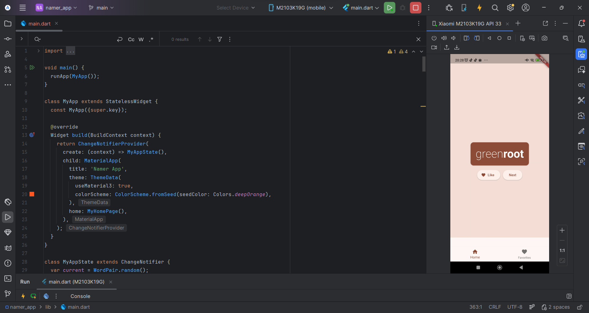

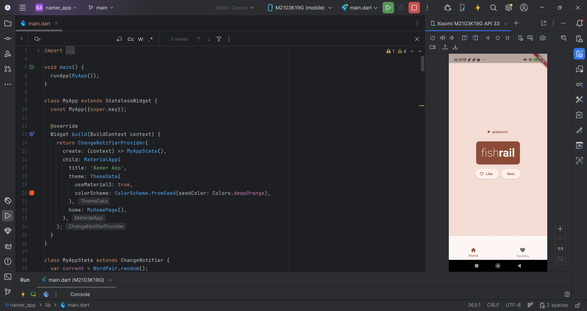

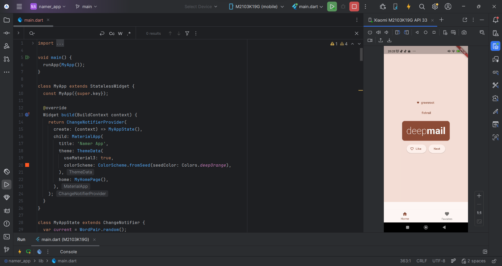

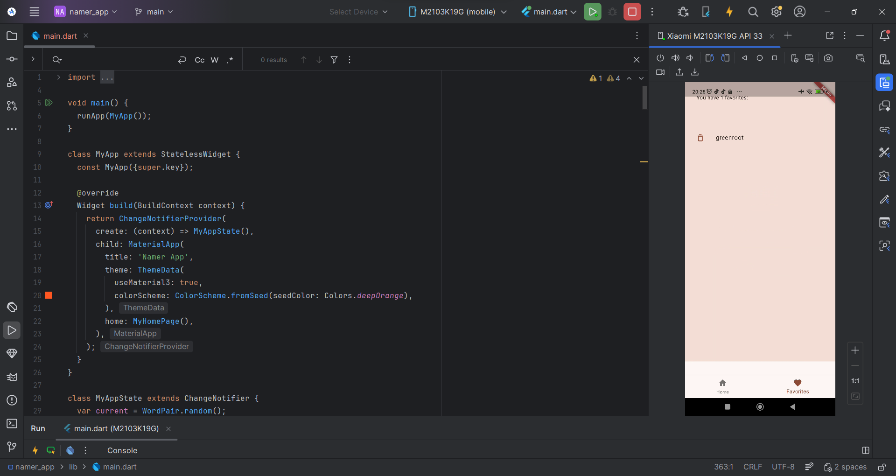

---