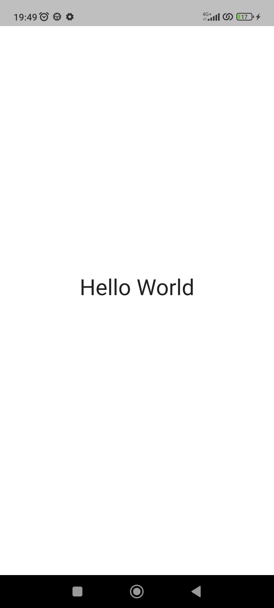
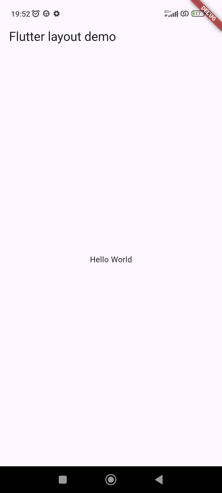
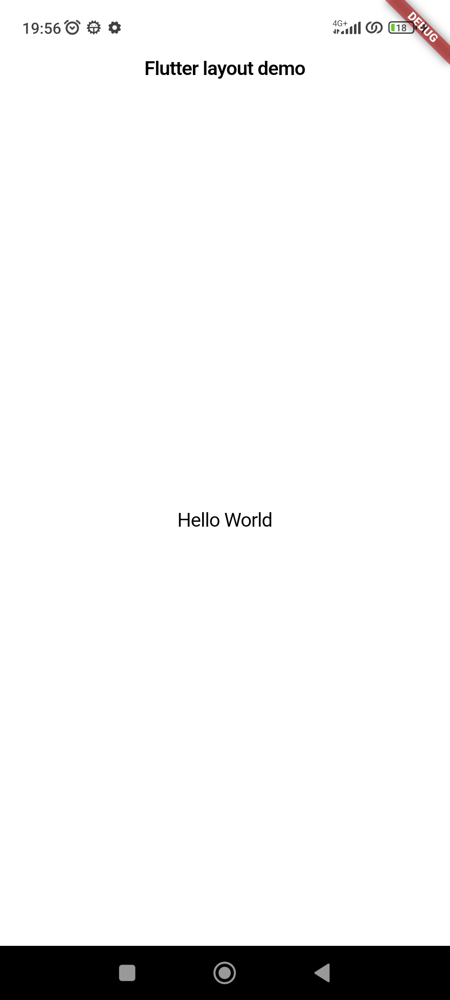
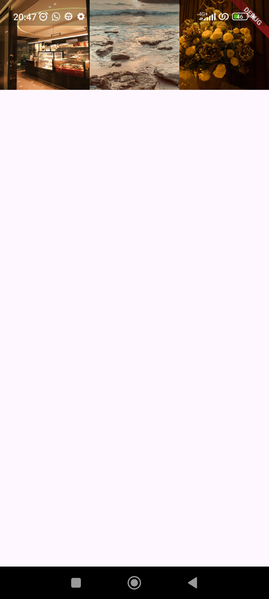

# 06 | Layout dan Navigasi

## Identitas Mahasiswa 

| Atribut | Nilai               |
| ------- | --------------------|
| Nama    | Dea Marselia Rahma  |
| NIM     | 244107060087        |
| Kelas   | SIB 2F              |

---

## Lay out a widget

Standard apps
```
class MyApp extends StatelessWidget {
  const MyApp({super.key});

  @override
  Widget build(BuildContext context) {
    return Container(
      decoration: const BoxDecoration(color: Colors.white),
      child: const Center(
        child: Text(
          'Hello World',
          textDirection: TextDirection.ltr,
          style: TextStyle(fontSize: 32, color: Colors.black87),
        ),
      ),
    );
  }
}
```

---
Material apps
```
class MyApp extends StatelessWidget {
  const MyApp({super.key});

  @override
  Widget build(BuildContext context) {
    const String appTitle = 'Flutter layout demo';
    return MaterialApp(
      title: appTitle,
      home: Scaffold(
        appBar: AppBar(title: const Text(appTitle)),
        body: const Center(
          child: Text('Hello World'),
        ),
      ),
    );
  }
}
```

---
Cupertino apps
```
class MyApp extends StatelessWidget {
  const MyApp({super.key});

  @override
  Widget build(BuildContext context) {
    return const CupertinoApp(
      title: 'Flutter layout demo',
      theme: CupertinoThemeData(
        brightness: Brightness.light,
        primaryColor: CupertinoColors.systemBlue,
      ),
      home: CupertinoPageScaffold(
        navigationBar: CupertinoNavigationBar(
          backgroundColor: CupertinoColors.systemGrey,
          middle: Text('Flutter layout demo'),
        ),
        child: Center(
          child: Column(
            mainAxisAlignment: MainAxisAlignment.center,
            children: [Text('Hello World')],
          ),
        ),
      ),
    );
  }
}
```
---

---

## Lay out multiple widgets vertically and horizontally

### Aligning widgets
---
#### Row
```
        body: Row(
          mainAxisAlignment: MainAxisAlignment.spaceEvenly,
          children: [
            Image.asset('images/pic1.jpg'),
            Image.asset('images/pic2.jpg'),
            Image.asset('images/pic3.jpg'),
          ],
        ),
```


Tampilan di atas mengalami **Right Overflow**, di mana hanya dua gambar yang muncul dengan sempurna, dan satu lainnya terpotong. Hal ini terjadi karena widget `Row` merender gambar sesuai resolusi aslinya tanpa pembatasan lebar.

---
#### Column
```
        body: Column(
          mainAxisAlignment: MainAxisAlignment.spaceEvenly,
          children: [
            Image.asset('images/pic1.jpg'),
            Image.asset('images/pic2.jpg'),
            Image.asset('images/pic3.jpg'),
          ],
        ),
```


Tampilan di atas mengalami **Bottom Overflow**, di mana hanya satu gambar yang muncul dengan sempurna, dengan satu gambar terpotong, dan satu gambar lainnya tidak muncul sama sekali. Hal ini terjadi karena widget `Column` merender gambar sesuai resolusi aslinya tanpa pembatasan tinggi.

---

### Sizing widgets
---
#### Row
```
        body: Row(
          crossAxisAlignment: CrossAxisAlignment.center,
          children: [
            Expanded(child: Image.asset('images/pic1.jpg')),
            Expanded(child: Image.asset('images/pic2.jpg')),
            Expanded(child: Image.asset('images/pic3.jpg')),
          ],
        ),
```


Pada tampilan di atas, setiap gambar dibungkus dengan widget `Expanded` tanpa mendefinisikan nilai `flex`. Secara default, setiap `Expanded` memiliki nilai **flex: 1**. Hal ini menyebabkan widget Row membagi lebar layar secara **sama rata dengan proporsional 1:1:1** kepada ketiga gambar tersebut. Hasilnya, ketiga gambar memiliki lebar yang identik satu sama lain.

---