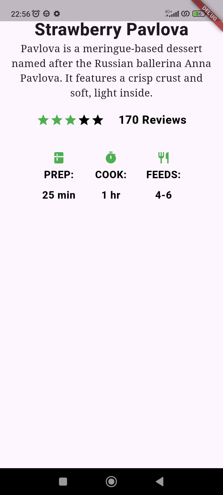
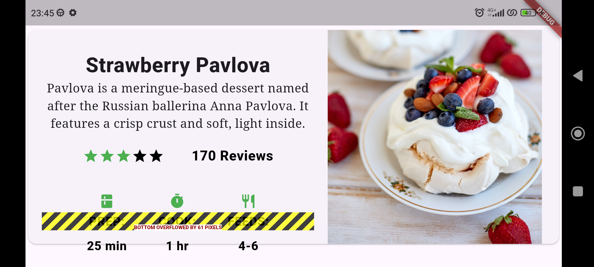
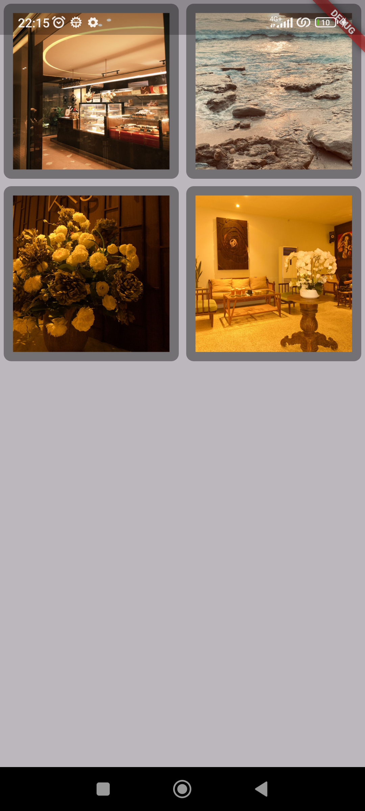
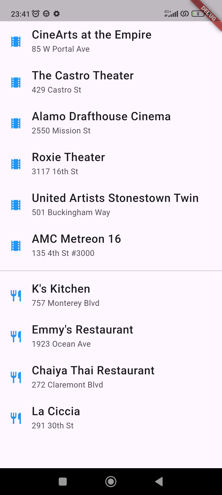
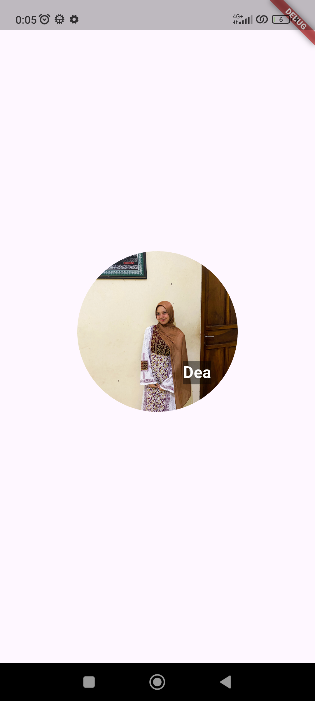
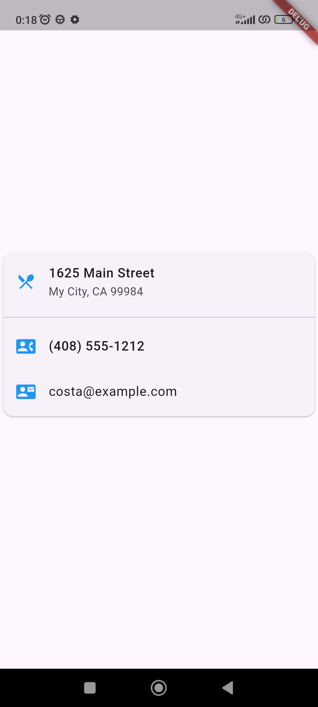
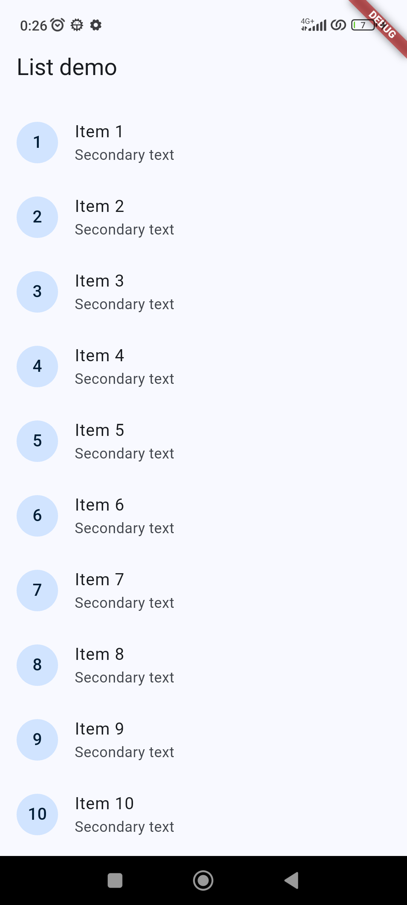

# 06 | Layout dan Navigasi

## Identitas Mahasiswa 

| Atribut | Nilai               |
| ------- | --------------------|
| Nama    | Dea Marselia Rahma  |
| NIM     | 244107060087        |
| Kelas   | SIB 2F              |

---

## Lay out a widget

Standard apps
```
class MyApp extends StatelessWidget {
  const MyApp({super.key});

  @override
  Widget build(BuildContext context) {
    return Container(
      decoration: const BoxDecoration(color: Colors.white),
      child: const Center(
        child: Text(
          'Hello World',
          textDirection: TextDirection.ltr,
          style: TextStyle(fontSize: 32, color: Colors.black87),
        ),
      ),
    );
  }
}
```

---
Material apps
```
class MyApp extends StatelessWidget {
  const MyApp({super.key});

  @override
  Widget build(BuildContext context) {
    const String appTitle = 'Flutter layout demo';
    return MaterialApp(
      title: appTitle,
      home: Scaffold(
        appBar: AppBar(title: const Text(appTitle)),
        body: const Center(
          child: Text('Hello World'),
        ),
      ),
    );
  }
}
```

---
Cupertino apps
```
class MyApp extends StatelessWidget {
  const MyApp({super.key});

  @override
  Widget build(BuildContext context) {
    return const CupertinoApp(
      title: 'Flutter layout demo',
      theme: CupertinoThemeData(
        brightness: Brightness.light,
        primaryColor: CupertinoColors.systemBlue,
      ),
      home: CupertinoPageScaffold(
        navigationBar: CupertinoNavigationBar(
          backgroundColor: CupertinoColors.systemGrey,
          middle: Text('Flutter layout demo'),
        ),
        child: Center(
          child: Column(
            mainAxisAlignment: MainAxisAlignment.center,
            children: [Text('Hello World')],
          ),
        ),
      ),
    );
  }
}
```
---

---

## Lay out multiple widgets vertically and horizontally

### Aligning widgets
---
#### Row
```
        body: Row(
          mainAxisAlignment: MainAxisAlignment.spaceEvenly,
          children: [
            Image.asset('images/pic1.jpg'),
            Image.asset('images/pic2.jpg'),
            Image.asset('images/pic3.jpg'),
          ],
        ),
```


Tampilan di atas mengalami **Right Overflow**, di mana hanya dua gambar yang muncul dengan sempurna, dan satu lainnya terpotong. Hal ini terjadi karena widget `Row` merender gambar sesuai resolusi aslinya tanpa pembatasan lebar.

---
#### Column
```
        body: Column(
          mainAxisAlignment: MainAxisAlignment.spaceEvenly,
          children: [
            Image.asset('images/pic1.jpg'),
            Image.asset('images/pic2.jpg'),
            Image.asset('images/pic3.jpg'),
          ],
        ),
```


Tampilan di atas mengalami **Bottom Overflow**, di mana hanya satu gambar yang muncul dengan sempurna, dengan satu gambar terpotong, dan satu gambar lainnya tidak muncul sama sekali. Hal ini terjadi karena widget `Column` merender gambar sesuai resolusi aslinya tanpa pembatasan tinggi.

---

### Sizing widgets
---
#### Row
```
        body: Row(
          crossAxisAlignment: CrossAxisAlignment.center,
          children: [
            Expanded(child: Image.asset('images/pic1.jpg')),
            Expanded(child: Image.asset('images/pic2.jpg')),
            Expanded(child: Image.asset('images/pic3.jpg')),
          ],
        ),
```


Pada tampilan di atas, setiap gambar dibungkus dengan widget `Expanded` tanpa mendefinisikan nilai `flex`. Secara default, setiap `Expanded` memiliki nilai **flex: 1**. Hal ini menyebabkan widget Row membagi lebar layar secara **sama rata dengan proporsional 1:1:1** kepada ketiga gambar tersebut. Hasilnya, ketiga gambar memiliki lebar yang identik satu sama lain.

---
```
        body: Row(
          crossAxisAlignment: CrossAxisAlignment.center,
          children: [
            Expanded(child: Image.asset('images/pic1.jpg')),
            Expanded(flex: 2, child: Image.asset('images/pic2.jpg')),
            Expanded(child: Image.asset('images/pic3.jpg')),
          ],
        ),
```


Pada tampilan di atas, gambar tengah diberikan nilai **flex: 2**, sementara gambar lainnya tetap **flex: 1**. Hal ini menginstruksikan Flutter untuk memberikan ruang **dua kali lebih besar** kepada gambar kedua dibandingkan gambar kesatu dan ketiga. Total rasio lebar yang digunakan adalah 1:2:1, sehingga gambar tengah terlihat lebih dominan dan lebar di dalam baris tersebut.

---

### Packing widgets
---
#### Row
```
        body: Row(
          mainAxisSize: MainAxisSize.min,
          children: [
            Icon(Icons.star, color: Colors.green[500]),
            Icon(Icons.star, color: Colors.green[500]),
            Icon(Icons.star, color: Colors.green[500]),
            const Icon(Icons.star, color: Colors.black),
            const Icon(Icons.star, color: Colors.black),
          ],
        ),
```


Pada tampilan di atas, kelima ikon bintang berkumpul di pojok kiri atas dan tidak tersebar memenuhi lebar layar. Hal ini disebabkan oleh penggunaan properti `mainAxisSize: MainAxisSize.min` pada widget `Row`. Secara default, `Row` akan mencoba mengambil ruang horizontal sebesar mungkin (`max`). Namun, dengan mengatur nilainya ke `min`, `Row` dipaksa untuk menyusut dan hanya mengambil ruang selebar total akumulasi ikon bintang.

---

### Nesting rows and columns
---
#### Ratings
```
    const titleText = Text(
      'Strawberry Pavlova',
      style: TextStyle(
        fontWeight: FontWeight.w800,
        letterSpacing: 0.5,
        fontSize: 30,
      ),
    );

    const subTitle = Text(
      'Pavlova is a meringue-based dessert named after the Russian ballerina '
      'Anna Pavlova. It features a crisp crust and soft, light inside.',
      textAlign: TextAlign.center,
      style: TextStyle(fontFamily: 'Georgia', fontSize: 18),
    );

    final stars = Row(
      mainAxisSize: MainAxisSize.min,
      children: [
        Icon(Icons.star, color: Colors.green[500]),
        Icon(Icons.star, color: Colors.green[500]),
        Icon(Icons.star, color: Colors.green[500]),
        const Icon(Icons.star, color: Colors.black),
        const Icon(Icons.star, color: Colors.black),
      ],
    );

    final ratings = Container(
      padding: const EdgeInsets.all(20),
      child: Row(
        mainAxisAlignment: MainAxisAlignment.spaceEvenly,
        children: [
          stars,
          const Text(
            '170 Reviews',
            style: TextStyle(
              color: Colors.black,
              fontWeight: FontWeight.w800,
              fontFamily: 'Roboto',
              letterSpacing: 0.5,
              fontSize: 20,
            ),
          ),
        ],
      ),
    );

    return MaterialApp(
      home: Scaffold(
        body: Center(
          child: Column(
                mainAxisSize: MainAxisSize.min, // Agar Column hanya setinggi isinya
                children: [
                  titleText,
                  subTitle,
                  ratings,
                ],
              ),
          ),
        ),
    );
```


Menampilkan visual rating **3 dari 5 bintang** yang disandingkan secara horizontal dengan teks ulasan.

---
#### IconList
```
    const titleText = Text(
      'Strawberry Pavlova',
      style: TextStyle(
        fontWeight: FontWeight.w800,
        letterSpacing: 0.5,
        fontSize: 30,
      ),
    );

    const subTitle = Text(
      'Pavlova is a meringue-based dessert named after the Russian ballerina '
      'Anna Pavlova. It features a crisp crust and soft, light inside.',
      textAlign: TextAlign.center,
      style: TextStyle(fontFamily: 'Georgia', fontSize: 18),
    );

    final stars = Row(
      mainAxisSize: MainAxisSize.min,
      children: [
        Icon(Icons.star, color: Colors.green[500]),
        Icon(Icons.star, color: Colors.green[500]),
        Icon(Icons.star, color: Colors.green[500]),
        const Icon(Icons.star, color: Colors.black),
        const Icon(Icons.star, color: Colors.black),
      ],
    );

    final ratings = Container(
      padding: const EdgeInsets.all(20),
      child: Row(
        mainAxisAlignment: MainAxisAlignment.spaceEvenly,
        children: [
          stars,
          const Text(
            '170 Reviews',
            style: TextStyle(
              color: Colors.black,
              fontWeight: FontWeight.w800,
              fontFamily: 'Roboto',
              letterSpacing: 0.5,
              fontSize: 20,
            ),
          ),
        ],
      ),
    );

    const descTextStyle = TextStyle(
      color: Colors.black,
      fontWeight: FontWeight.w800,
      fontFamily: 'Roboto',
      letterSpacing: 0.5,
      fontSize: 18,
      height: 2,
    );

    final iconList = DefaultTextStyle.merge(
      style: descTextStyle,
      child: Container(
        padding: const EdgeInsets.all(20),
        child: Row(
          mainAxisAlignment: MainAxisAlignment.spaceEvenly,
          children: [
            Column(children: [Icon(Icons.kitchen, color: Colors.green[500]), const Text('PREP:'), const Text('25 min')]),
            Column(children: [Icon(Icons.timer, color: Colors.green[500]), const Text('COOK:'), const Text('1 hr')]),
            Column(children: [Icon(Icons.restaurant, color: Colors.green[500]), const Text('FEEDS:'), const Text('4-6')]),
          ],
        ),
      ),
    );

    return MaterialApp(
      home: Scaffold(
        body: Center(
          child: Column(
                mainAxisSize: MainAxisSize.min, // Agar Column hanya setinggi isinya
                children: [
                  titleText,
                  subTitle,
                  ratings,
                  iconList,
                ],
              ),
          ),
        ),
    );
```


Menampilkan tiga kolom informasi yang sejajar secara horizontal, yaitu PREP selama 25 menit, COOK selama 1 jam dan FEEDS untuk 4-6 orang.

---

#### LeftColumn
```
    const titleText = Text(
      'Strawberry Pavlova',
      style: TextStyle(
        fontWeight: FontWeight.w800,
        letterSpacing: 0.5,
        fontSize: 30,
      ),
    );

    const subTitle = Text(
      'Pavlova is a meringue-based dessert named after the Russian ballerina '
      'Anna Pavlova. It features a crisp crust and soft, light inside.',
      textAlign: TextAlign.center,
      style: TextStyle(fontFamily: 'Georgia', fontSize: 18),
    );

    final stars = Row(
      mainAxisSize: MainAxisSize.min,
      children: [
        Icon(Icons.star, color: Colors.green[500]),
        Icon(Icons.star, color: Colors.green[500]),
        Icon(Icons.star, color: Colors.green[500]),
        const Icon(Icons.star, color: Colors.black),
        const Icon(Icons.star, color: Colors.black),
      ],
    );

    final ratings = Container(
      padding: const EdgeInsets.all(20),
      child: Row(
        mainAxisAlignment: MainAxisAlignment.spaceEvenly,
        children: [
          stars,
          const Text(
            '170 Reviews',
            style: TextStyle(
              color: Colors.black,
              fontWeight: FontWeight.w800,
              fontFamily: 'Roboto',
              letterSpacing: 0.5,
              fontSize: 20,
            ),
          ),
        ],
      ),
    );

    const descTextStyle = TextStyle(
      color: Colors.black,
      fontWeight: FontWeight.w800,
      fontFamily: 'Roboto',
      letterSpacing: 0.5,
      fontSize: 18,
      height: 2,
    );

    final iconList = DefaultTextStyle.merge(
      style: descTextStyle,
      child: Container(
        padding: const EdgeInsets.all(20),
        child: Row(
          mainAxisAlignment: MainAxisAlignment.spaceEvenly,
          children: [
            Column(children: [Icon(Icons.kitchen, color: Colors.green[500]), const Text('PREP:'), const Text('25 min')]),
            Column(children: [Icon(Icons.timer, color: Colors.green[500]), const Text('COOK:'), const Text('1 hr')]),
            Column(children: [Icon(Icons.restaurant, color: Colors.green[500]), const Text('FEEDS:'), const Text('4-6')]),
          ],
        ),
      ),
    );

    final leftColumn = Container(
      padding: const EdgeInsets.fromLTRB(20, 30, 20, 20),
      child: Column(
        children: [titleText, subTitle, ratings, iconList],
      ),
    );
    
    return MaterialApp(
      home: Scaffold(
        body: Center(
          child: leftColumn,
          ),
        ),
    );
```


Secara default, widget `Column` memiliki properti `mainAxisSize: MainAxisSize.max`. Karena `leftColumn` sekarang mengisi seluruh tinggi layar yang tersedia, kontennya secara otomatis dimulai dari **titik teratas** atau titik awal sumbu vertikal.

---

#### Image
```
    const titleText = Text(
      'Strawberry Pavlova',
      style: TextStyle(
        fontWeight: FontWeight.w800,
        letterSpacing: 0.5,
        fontSize: 30,
      ),
    );

    const subTitle = Text(
      'Pavlova is a meringue-based dessert named after the Russian ballerina '
      'Anna Pavlova. It features a crisp crust and soft, light inside.',
      textAlign: TextAlign.center,
      style: TextStyle(fontFamily: 'Georgia', fontSize: 18),
    );

    final stars = Row(
      mainAxisSize: MainAxisSize.min,
      children: [
        Icon(Icons.star, color: Colors.green[500]),
        Icon(Icons.star, color: Colors.green[500]),
        Icon(Icons.star, color: Colors.green[500]),
        const Icon(Icons.star, color: Colors.black),
        const Icon(Icons.star, color: Colors.black),
      ],
    );

    final ratings = Container(
      padding: const EdgeInsets.all(20),
      child: Row(
        mainAxisAlignment: MainAxisAlignment.spaceEvenly,
        children: [
          stars,
          const Text(
            '170 Reviews',
            style: TextStyle(
              color: Colors.black,
              fontWeight: FontWeight.w800,
              fontFamily: 'Roboto',
              letterSpacing: 0.5,
              fontSize: 20,
            ),
          ),
        ],
      ),
    );

    const descTextStyle = TextStyle(
      color: Colors.black,
      fontWeight: FontWeight.w800,
      fontFamily: 'Roboto',
      letterSpacing: 0.5,
      fontSize: 18,
      height: 2,
    );

    final iconList = DefaultTextStyle.merge(
      style: descTextStyle,
      child: Container(
        padding: const EdgeInsets.all(20),
        child: Row(
          mainAxisAlignment: MainAxisAlignment.spaceEvenly,
          children: [
            Column(children: [Icon(Icons.kitchen, color: Colors.green[500]), const Text('PREP:'), const Text('25 min')]),
            Column(children: [Icon(Icons.timer, color: Colors.green[500]), const Text('COOK:'), const Text('1 hr')]),
            Column(children: [Icon(Icons.restaurant, color: Colors.green[500]), const Text('FEEDS:'), const Text('4-6')]),
          ],
        ),
      ),
    );

    final leftColumn = Container(
      padding: const EdgeInsets.fromLTRB(20, 30, 20, 20),
      child: Column(
        children: [titleText, subTitle, ratings, iconList],
      ),
    );
    
    final mainImage = Image.asset(
      'images/pavlova.jpg',
      fit: BoxFit.cover,
    );

    return MaterialApp(
      home: Scaffold(
        body: Center(
          child: Container(
            margin: const EdgeInsets.fromLTRB(0, 40, 0, 30),
            height: 600,
            child: Card(
              child: Row(
                crossAxisAlignment: CrossAxisAlignment.start,
                children: [
                  SizedBox(width: 440, child: leftColumn),
                  mainImage,
                ],
              ),
            ),
          ),
        ),
      ),
    );
```


Menampilkan tata letak horizontal yang membagi layar menjadi dua bagian utama, yaitu kolom informasi teks di sisi kiri dan foto produk Strawberry Pavlova di sisi kanan. Namun, terjadi masalah overflow pada bagian bawah kolom teks karena ukuran konten melebihi batas tinggi layar atau kontainer yang ditandai dengan garis kuning-hitam.

---

## Common layout widgets

### Container
---
```
  Widget build(BuildContext context) {
    return MaterialApp(
      home: Scaffold(
        body: Center(
          child: _buildImageColumn(),
        ),
      ),
    );
  }

  Widget _buildImageColumn() {
    return Container(
      decoration: const BoxDecoration(color: Colors.black26),
      child: Column(children: [_buildImageRow(1), _buildImageRow(3)]),
    );
  }

  Widget _buildDecoratedImage(int imageIndex) => Expanded(
    child: Container(
      decoration: BoxDecoration(
        border: Border.all(width: 10, color: Colors.black38),
        borderRadius: const BorderRadius.all(Radius.circular(8)),
      ),
      margin: const EdgeInsets.all(4),
      child: Image.asset('images/pic$imageIndex.jpg'),
    ),
  );

  Widget _buildImageRow(int imageIndex) => Row(
    children: [
      _buildDecoratedImage(imageIndex),
      _buildDecoratedImage(imageIndex + 1),
    ],
  );
```


Menampilkan 4 foto yang disusun menjadi 2 baris dan 2 kolom. Method `_buildImageColumn` membuat area background utama berwarna abu-abu muda dan menyusun dua baris foto dari atas ke bawah, method `_buildImageRow` menyusun dua foto agar berjejer kiri dan kanan dalam satu barisnya, dan method `_buildDecoratedImage` menghias tiap foto dengan bingkai tebal berwarna abu-abu gelap, membuat sudut bingkainya melengkung, dan memberi jarak antar tepi agar foto tidak saling menempel.

---

### GridView
---
```
  Widget build(BuildContext context) {
    return MaterialApp(
      home: Scaffold(
        body: Center(
          child: _buildGrid(),
        ),
      ),
    );
  }

  Widget _buildGrid() => GridView.extent(
    maxCrossAxisExtent: 150,
    padding: const EdgeInsets.all(4),
    mainAxisSpacing: 4,
    crossAxisSpacing: 4,
    children: _buildGridTileList(30),
  );

  // The images are saved with names pic0.jpg, pic1.jpg...pic29.jpg.
  // The List.generate() constructor allows an easy way to create
  // a list when objects have a predictable naming pattern.
  List<Widget> _buildGridTileList(int count) =>
      List.generate(count, (i) => Image.asset('images/pic${i + 1}.jpg'));
```


Menampilkan 30 gambar dalam bentuk susunan grid yang bisa discroll ke atas dan ke bawah. Kode ini secara otomatis mencetak dan memanggil gambar dari file `pic1.jpg` hingga `pic30.jpg` secara berurutan, lalu membatasinya agar lebar setiap foto maksimal **150 px** sehingga pada ukuran layar HP kamu susunannya otomatis pas menjadi 3 kolom. Selain itu, ditambahkan juga jarak spasi sebesar **4 px** di setiap sisi gambar agar tampilannya rapi dan tidak saling berdempetan.

---

### ListView
---
```
  Widget build(BuildContext context) {
    return MaterialApp(
      home: Scaffold(
        body: _buildList(),
      ),
    );
  }

  Widget _buildList() {
    return ListView(
      children: [
        _tile('CineArts at the Empire', '85 W Portal Ave', Icons.theaters),
        _tile('The Castro Theater', '429 Castro St', Icons.theaters),
        _tile('Alamo Drafthouse Cinema', '2550 Mission St', Icons.theaters),
        _tile('Roxie Theater', '3117 16th St', Icons.theaters),
        _tile(
          'United Artists Stonestown Twin',
          '501 Buckingham Way',
          Icons.theaters,
        ),
        _tile('AMC Metreon 16', '135 4th St #3000', Icons.theaters),
        const Divider(),
        _tile('K\'s Kitchen', '757 Monterey Blvd', Icons.restaurant),
        _tile('Emmy\'s Restaurant', '1923 Ocean Ave', Icons.restaurant),
        _tile('Chaiya Thai Restaurant', '272 Claremont Blvd', Icons.restaurant),
        _tile('La Ciccia', '291 30th St', Icons.restaurant),
      ],
    );
  }

  ListTile _tile(String title, String subtitle, IconData icon) {
    return ListTile(
      title: Text(
        title,
        style: const TextStyle(fontWeight: FontWeight.w500, fontSize: 20),
      ),
      subtitle: Text(subtitle),
      leading: Icon(icon, color: Colors.blue[500]),
    );
  }
```


Menampilkan daftar vertikal yang bisa discroll ke atas dan ke bawah, berisi informasi nama-nama bioskop dan restoran. Setiap baris pada daftar tersebut dibangun menggunakan komponen `ListTile` yang menampilkan sebuah ikon berwarna biru di sisi kiri, judul tempat dengan huruf yang lebih besar dan tebal, serta alamat tempat sebagai sub-judul di bawahnya. Selain itu, ditambahkan juga sebuah garis tipis melintang (`Divider`) di tengah-tengah daftar yang berfungsi untuk memisahkan kelompok bioskop dengan kelompok restoran agar tampilannya lebih rapi dan terorganisir.

---

### Stack
---
```
  Widget build(BuildContext context) {
    return MaterialApp(
      home: Scaffold(
        body: Center(
          child: _buildStack(),
        ),
      ),
    );
  }

  Widget _buildStack() {
    return Stack(
      alignment: const Alignment(0.6, 0.6),
      children: [
        const CircleAvatar(
          backgroundImage: AssetImage('images/pic.jpg'),
          radius: 100,
        ),
        Container(
          decoration: const BoxDecoration(color: Colors.black45),
          child: const Text(
            'Dea',
            style: TextStyle(
              fontSize: 20,
              fontWeight: FontWeight.bold,
              color: Colors.white,
            ),
          ),
        ),
      ],
    );
  }
```


Menampilkan sebuah gambar profil berbentuk lingkaran besar di tengah layar, yang di atasnya ditumpuk dengan sebuah kotak hitam transparan berisi tulisan "Dea" berwarna putih dan tebal. Posisi tulisan tersebut diletakkan menumpuk sedikit ke arah kanan bawah dari gambar profil karena pengaturan tata letak (`alignment`) khusus pada komponen tumpukannya.

---

### Card
---
```
  Widget build(BuildContext context) {
    return MaterialApp(
      home: Scaffold(
        body: Center(
          child: _buildCard(),
        ),
      ),
    );
  }

  Widget _buildCard() {
    return SizedBox(
      height: 210,
      child: Card(
        child: Column(
          children: [
            ListTile(
              title: const Text(
                '1625 Main Street',
                style: TextStyle(fontWeight: FontWeight.w500),
              ),
              subtitle: const Text('My City, CA 99984'),
              leading: Icon(Icons.restaurant_menu, color: Colors.blue[500]),
            ),
            const Divider(),
            ListTile(
              title: const Text(
                '(408) 555-1212',
                style: TextStyle(fontWeight: FontWeight.w500),
              ),
              leading: Icon(Icons.contact_phone, color: Colors.blue[500]),
            ),
            ListTile(
              title: const Text('costa@example.com'),
              leading: Icon(Icons.contact_mail, color: Colors.blue[500]),
            ),
          ],
        ),
      ),
    );
  }
```


Menampilkan sebuah card dengan sudut melengkung dan sedikit efek bayangan yang melayang di tengah layar. Card yang dibatasi tingginya maksimal `210 px` ini berisi susunan informasi kontak dari atas ke bawah, diawali dengan teks alamat lokasi beserta ikon restoran, sebuah `Divider`, lalu dilanjutkan dengan teks nomor telepon dan alamat email yang masing-masing juga dilengkapi dengan ikon pendukung berwarna biru di sisi kirinya.

---

### ListTile
```
// Copyright 2019 The Flutter team. All rights reserved.
// Use of this source code is governed by a BSD-style license that can be
// found in the LICENSE file.

import 'package:flutter/material.dart';

class ListDemo extends StatelessWidget {
  const ListDemo({super.key, required this.type});

  final ListDemoType type;

  @override
  Widget build(BuildContext context) {
    return MaterialApp(
      theme: ThemeData(
        colorScheme: ColorScheme.fromSeed(seedColor: Colors.blue),
      ),
      home: Scaffold(
        appBar: AppBar(
          automaticallyImplyLeading: false,
          title: const Text('List demo'),
        ),
        body: Scrollbar(
          child: ListView(
            restorationId: 'list_demo_list_view',
            padding: const EdgeInsets.symmetric(vertical: 8),
            children: [
              for (var index = 1; index < 21; index++)
                ListTile(
                  leading: ExcludeSemantics(
                    child: CircleAvatar(child: Text('$index')),
                  ),
                  title: Text('Item $index'),
                  subtitle: type == ListDemoType.twoLine
                      ? const Text('Secondary text')
                      : null,
                ),
            ],
          ),
        ),
      ),
    );
  }
}

enum ListDemoType { oneLine, twoLine }

void main() {
  runApp(const ListDemo(type: ListDemoType.twoLine));
}
```


Menampilkan daftar berurutan dari angka 1 hingga 20 yang bisa discroll ke atas dan ke bawah, lengkap dengan bilah judul (`AppBar`) bertuliskan **List demo** di bagian atas layarnya. Setiap baris dalam daftar tersebut dibangun menggunakan komponen `ListTile` yang dicetak secara otomatis menggunakan perulangan, di mana masing-masing baris memuat sebuah lingkaran biru berisi nomor urut di sisi kiri, teks judul utama (**Item 1**, **Item 2**, dst.), serta teks tambahan (`Secondary text`) sebagai sub-judul tepat di bawahnya.

---