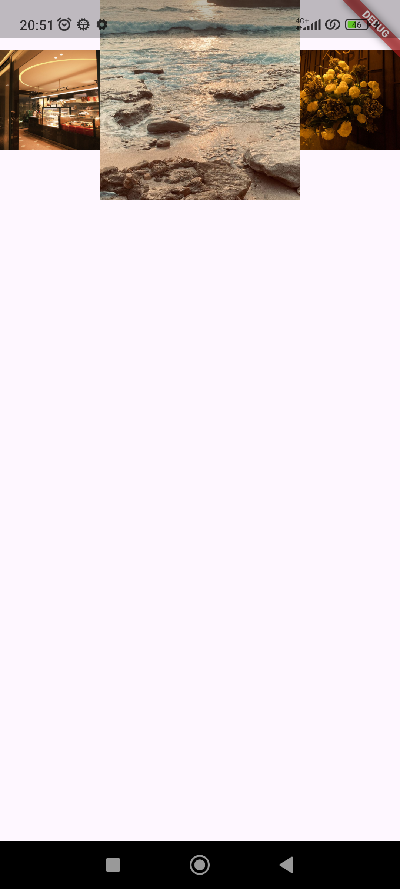
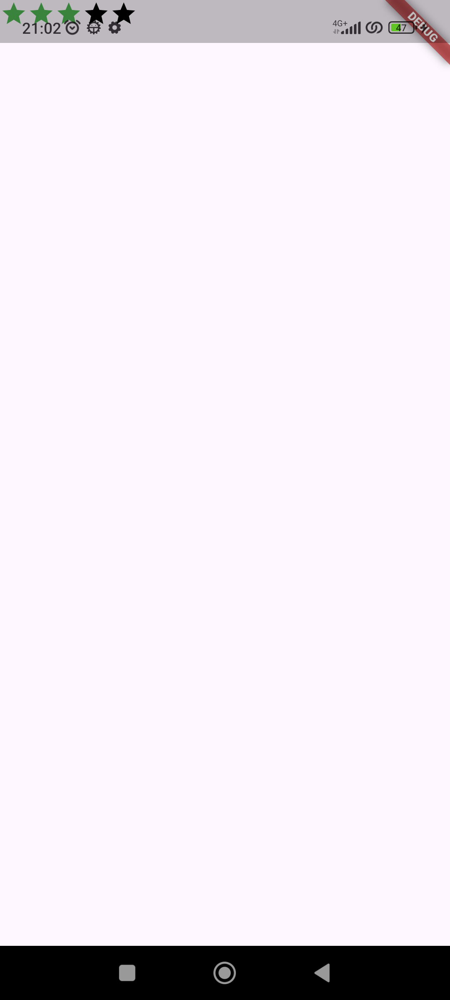
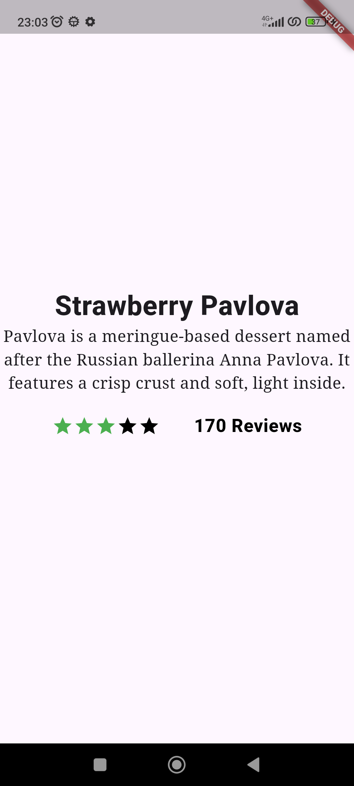
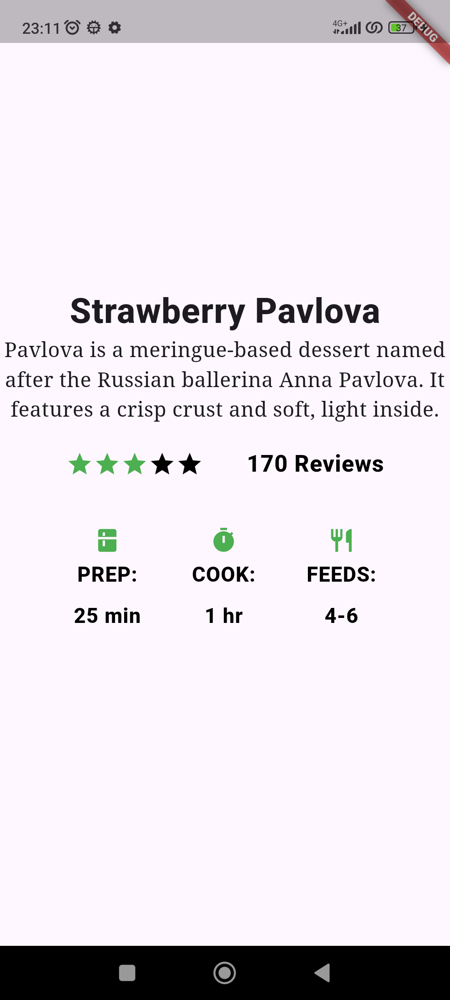

# 06 | Layout dan Navigasi

## Identitas Mahasiswa 

| Atribut | Nilai               |
| ------- | --------------------|
| Nama    | Dea Marselia Rahma  |
| NIM     | 244107060087        |
| Kelas   | SIB 2F              |

---

## Lay out a widget

Standard apps
```
class MyApp extends StatelessWidget {
  const MyApp({super.key});

  @override
  Widget build(BuildContext context) {
    return Container(
      decoration: const BoxDecoration(color: Colors.white),
      child: const Center(
        child: Text(
          'Hello World',
          textDirection: TextDirection.ltr,
          style: TextStyle(fontSize: 32, color: Colors.black87),
        ),
      ),
    );
  }
}
```

---
Material apps
```
class MyApp extends StatelessWidget {
  const MyApp({super.key});

  @override
  Widget build(BuildContext context) {
    const String appTitle = 'Flutter layout demo';
    return MaterialApp(
      title: appTitle,
      home: Scaffold(
        appBar: AppBar(title: const Text(appTitle)),
        body: const Center(
          child: Text('Hello World'),
        ),
      ),
    );
  }
}
```

---
Cupertino apps
```
class MyApp extends StatelessWidget {
  const MyApp({super.key});

  @override
  Widget build(BuildContext context) {
    return const CupertinoApp(
      title: 'Flutter layout demo',
      theme: CupertinoThemeData(
        brightness: Brightness.light,
        primaryColor: CupertinoColors.systemBlue,
      ),
      home: CupertinoPageScaffold(
        navigationBar: CupertinoNavigationBar(
          backgroundColor: CupertinoColors.systemGrey,
          middle: Text('Flutter layout demo'),
        ),
        child: Center(
          child: Column(
            mainAxisAlignment: MainAxisAlignment.center,
            children: [Text('Hello World')],
          ),
        ),
      ),
    );
  }
}
```
---

---

## Lay out multiple widgets vertically and horizontally

### Aligning widgets
---
#### Row
```
        body: Row(
          mainAxisAlignment: MainAxisAlignment.spaceEvenly,
          children: [
            Image.asset('images/pic1.jpg'),
            Image.asset('images/pic2.jpg'),
            Image.asset('images/pic3.jpg'),
          ],
        ),
```


Tampilan di atas mengalami **Right Overflow**, di mana hanya dua gambar yang muncul dengan sempurna, dan satu lainnya terpotong. Hal ini terjadi karena widget `Row` merender gambar sesuai resolusi aslinya tanpa pembatasan lebar.

---
#### Column
```
        body: Column(
          mainAxisAlignment: MainAxisAlignment.spaceEvenly,
          children: [
            Image.asset('images/pic1.jpg'),
            Image.asset('images/pic2.jpg'),
            Image.asset('images/pic3.jpg'),
          ],
        ),
```


Tampilan di atas mengalami **Bottom Overflow**, di mana hanya satu gambar yang muncul dengan sempurna, dengan satu gambar terpotong, dan satu gambar lainnya tidak muncul sama sekali. Hal ini terjadi karena widget `Column` merender gambar sesuai resolusi aslinya tanpa pembatasan tinggi.

---

### Sizing widgets
---
#### Row
```
        body: Row(
          crossAxisAlignment: CrossAxisAlignment.center,
          children: [
            Expanded(child: Image.asset('images/pic1.jpg')),
            Expanded(child: Image.asset('images/pic2.jpg')),
            Expanded(child: Image.asset('images/pic3.jpg')),
          ],
        ),
```


Pada tampilan di atas, setiap gambar dibungkus dengan widget `Expanded` tanpa mendefinisikan nilai `flex`. Secara default, setiap `Expanded` memiliki nilai **flex: 1**. Hal ini menyebabkan widget Row membagi lebar layar secara **sama rata dengan proporsional 1:1:1** kepada ketiga gambar tersebut. Hasilnya, ketiga gambar memiliki lebar yang identik satu sama lain.

---
```
        body: Row(
          crossAxisAlignment: CrossAxisAlignment.center,
          children: [
            Expanded(child: Image.asset('images/pic1.jpg')),
            Expanded(flex: 2, child: Image.asset('images/pic2.jpg')),
            Expanded(child: Image.asset('images/pic3.jpg')),
          ],
        ),
```


Pada tampilan di atas, gambar tengah diberikan nilai **flex: 2**, sementara gambar lainnya tetap **flex: 1**. Hal ini menginstruksikan Flutter untuk memberikan ruang **dua kali lebih besar** kepada gambar kedua dibandingkan gambar kesatu dan ketiga. Total rasio lebar yang digunakan adalah 1:2:1, sehingga gambar tengah terlihat lebih dominan dan lebar di dalam baris tersebut.

---

### Packing widgets
---
#### Row
```
        body: Row(
          mainAxisSize: MainAxisSize.min,
          children: [
            Icon(Icons.star, color: Colors.green[500]),
            Icon(Icons.star, color: Colors.green[500]),
            Icon(Icons.star, color: Colors.green[500]),
            const Icon(Icons.star, color: Colors.black),
            const Icon(Icons.star, color: Colors.black),
          ],
        ),
```


Pada tampilan di atas, kelima ikon bintang berkumpul di pojok kiri atas dan tidak tersebar memenuhi lebar layar. Hal ini disebabkan oleh penggunaan properti `mainAxisSize: MainAxisSize.min` pada widget `Row`. Secara default, `Row` akan mencoba mengambil ruang horizontal sebesar mungkin (`max`). Namun, dengan mengatur nilainya ke `min`, `Row` dipaksa untuk menyusut dan hanya mengambil ruang selebar total akumulasi ikon bintang.

---

### Nesting rows and columns
---
#### Ratings
```
    const titleText = Text(
      'Strawberry Pavlova',
      style: TextStyle(
        fontWeight: FontWeight.w800,
        letterSpacing: 0.5,
        fontSize: 30,
      ),
    );

    const subTitle = Text(
      'Pavlova is a meringue-based dessert named after the Russian ballerina '
      'Anna Pavlova. It features a crisp crust and soft, light inside.',
      textAlign: TextAlign.center,
      style: TextStyle(fontFamily: 'Georgia', fontSize: 18),
    );

    final stars = Row(
      mainAxisSize: MainAxisSize.min,
      children: [
        Icon(Icons.star, color: Colors.green[500]),
        Icon(Icons.star, color: Colors.green[500]),
        Icon(Icons.star, color: Colors.green[500]),
        const Icon(Icons.star, color: Colors.black),
        const Icon(Icons.star, color: Colors.black),
      ],
    );

    final ratings = Container(
      padding: const EdgeInsets.all(20),
      child: Row(
        mainAxisAlignment: MainAxisAlignment.spaceEvenly,
        children: [
          stars,
          const Text(
            '170 Reviews',
            style: TextStyle(
              color: Colors.black,
              fontWeight: FontWeight.w800,
              fontFamily: 'Roboto',
              letterSpacing: 0.5,
              fontSize: 20,
            ),
          ),
        ],
      ),
    );

    return MaterialApp(
      home: Scaffold(
        body: Center(
          child: Column(
                mainAxisSize: MainAxisSize.min, // Agar Column hanya setinggi isinya
                children: [
                  titleText,
                  subTitle,
                  ratings,
                ],
              ),
          ),
        ),
    );
```


Menampilkan visual rating **3 dari 5 bintang** yang disandingkan secara horizontal dengan teks ulasan.

---
#### IconList
```
    const titleText = Text(
      'Strawberry Pavlova',
      style: TextStyle(
        fontWeight: FontWeight.w800,
        letterSpacing: 0.5,
        fontSize: 30,
      ),
    );

    const subTitle = Text(
      'Pavlova is a meringue-based dessert named after the Russian ballerina '
      'Anna Pavlova. It features a crisp crust and soft, light inside.',
      textAlign: TextAlign.center,
      style: TextStyle(fontFamily: 'Georgia', fontSize: 18),
    );

    final stars = Row(
      mainAxisSize: MainAxisSize.min,
      children: [
        Icon(Icons.star, color: Colors.green[500]),
        Icon(Icons.star, color: Colors.green[500]),
        Icon(Icons.star, color: Colors.green[500]),
        const Icon(Icons.star, color: Colors.black),
        const Icon(Icons.star, color: Colors.black),
      ],
    );

    final ratings = Container(
      padding: const EdgeInsets.all(20),
      child: Row(
        mainAxisAlignment: MainAxisAlignment.spaceEvenly,
        children: [
          stars,
          const Text(
            '170 Reviews',
            style: TextStyle(
              color: Colors.black,
              fontWeight: FontWeight.w800,
              fontFamily: 'Roboto',
              letterSpacing: 0.5,
              fontSize: 20,
            ),
          ),
        ],
      ),
    );

    const descTextStyle = TextStyle(
      color: Colors.black,
      fontWeight: FontWeight.w800,
      fontFamily: 'Roboto',
      letterSpacing: 0.5,
      fontSize: 18,
      height: 2,
    );

    final iconList = DefaultTextStyle.merge(
      style: descTextStyle,
      child: Container(
        padding: const EdgeInsets.all(20),
        child: Row(
          mainAxisAlignment: MainAxisAlignment.spaceEvenly,
          children: [
            Column(children: [Icon(Icons.kitchen, color: Colors.green[500]), const Text('PREP:'), const Text('25 min')]),
            Column(children: [Icon(Icons.timer, color: Colors.green[500]), const Text('COOK:'), const Text('1 hr')]),
            Column(children: [Icon(Icons.restaurant, color: Colors.green[500]), const Text('FEEDS:'), const Text('4-6')]),
          ],
        ),
      ),
    );

    return MaterialApp(
      home: Scaffold(
        body: Center(
          child: Column(
                mainAxisSize: MainAxisSize.min, // Agar Column hanya setinggi isinya
                children: [
                  titleText,
                  subTitle,
                  ratings,
                  iconList,
                ],
              ),
          ),
        ),
    );
```


Menampilkan tiga kolom informasi yang sejajar secara horizontal, yaitu PREP selama 25 menit, COOK selama 1 jam dan FEEDS untuk 4-6 orang.

---