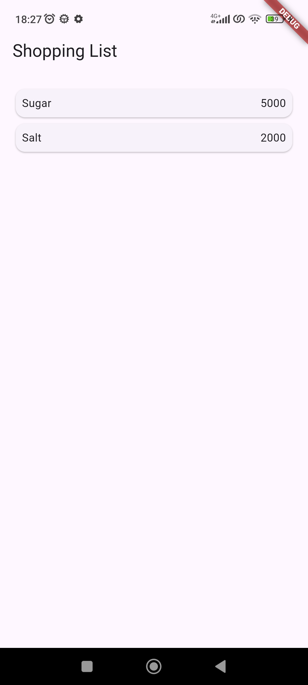
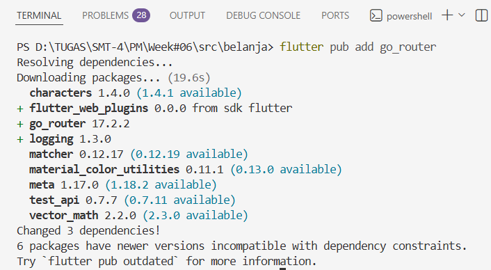
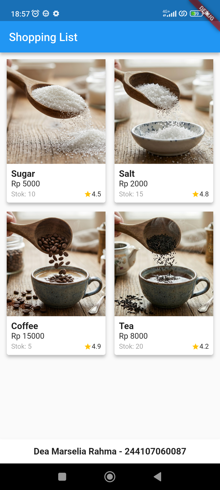

# 06 | Layout dan Navigasi

## Identitas Mahasiswa 

| Atribut | Nilai               |
| ------- | --------------------|
| Nama    | Dea Marselia Rahma  |
| NIM     | 244107060087        |
| Kelas   | SIB 2F              |

---

## Praktikum 5: Membangun Navigasi di Flutter

### Class item_page.dart
```
import 'package:flutter/material.dart';
import '../models/item.dart';

class ItemPage extends StatelessWidget {
  @override
  Widget build(BuildContext context) {

    final Item item = ModalRoute.of(context)!.settings.arguments as Item;

    return Scaffold(
      appBar: AppBar(
        title: Text('Shopping List'),
      ),
      body: Center(
        child: Text('${item.name} with ${item.price}'),
      ),
    );
  }
}
```
---

### Class item.dart
```
class Item {
  String name;
  int price;

  Item({required this.name, required this.price});
}
```
---

### Class home_page.dart
```
import 'package:flutter/material.dart';
import '../models/item.dart';

class HomePage extends StatelessWidget {
  final List<Item> items = [
    Item(name: 'Sugar', price: 5000),
    Item(name: 'Salt', price: 2000),
  ];

  @override
  Widget build(BuildContext context) {
    return Scaffold(
      appBar: AppBar(
        title: Text('Shopping List'),
      ),
      body: Container(
        margin: EdgeInsets.all(8),
        child: ListView.builder(
          padding: EdgeInsets.all(8),
          itemCount: items.length,
          itemBuilder: (context, index) {
            final item = items[index];
            return InkWell(
              onTap: () {
                Navigator.pushNamed(context, '/item', arguments: item);
              },
              child: Card(
                child: Container(
                  margin: EdgeInsets.all(8),
                  child: Row(
                    children: [
                      Expanded(child: Text(item.name)),
                      Expanded(
                        child: Text(
                          item.price.toString(),
                          textAlign: TextAlign.end,
                        ),
                      ),
                    ],
                  ),
                ),
              ),
            );
          },
        ),
      ),
    );
  }
}
```
---

### Class main.dart
```
import 'package:flutter/material.dart';
import 'pages/home_page.dart';
import 'pages/item_page.dart';

void main() {
  runApp(MaterialApp(
    initialRoute: '/',
    routes: {
      '/': (context) => HomePage(),
      '/item': (context) => ItemPage(),
    },
  ));
}
```
---


---

## Tugas Praktikum 2

### Install go_router


---

### Class item.dart
```
class Item {
  String name;
  int price;
  String imageUrl;
  int stock;
  double rating;

  Item({
    required this.name,
    required this.price,
    required this.imageUrl,
    required this.stock,
    required this.rating,
  });
}
```
---

### Class home_page.dart
```
import 'package:flutter/material.dart';
import 'package:go_router/go_router.dart';
import '../models/item.dart';

class HomePage extends StatelessWidget {
  final List<Item> items = [
    Item(name: 'Sugar', price: 5000, imageUrl: 'images/sugar.png', stock: 10, rating: 4.5),
    Item(name: 'Salt', price: 2000, imageUrl: 'images/salt.jpg', stock: 15, rating: 4.8),
    Item(name: 'Coffee', price: 15000, imageUrl: 'images/coffee.png', stock: 5, rating: 4.9),
    Item(name: 'Tea', price: 8000,imageUrl: 'images/tea.jpg', stock: 20, rating: 4.2),
  ];

  @override
  Widget build(BuildContext context) {

    return Scaffold(
      appBar: AppBar(
        title: const Text('Shopping List'),
      ),

      body: GridView.builder(
        padding: const EdgeInsets.all(8),
        gridDelegate: const SliverGridDelegateWithFixedCrossAxisCount(
          crossAxisCount: 2,
          childAspectRatio: 0.7,
          crossAxisSpacing: 8,
          mainAxisSpacing: 8,
        ),
        itemCount: items.length,
        itemBuilder: (context, index) {
          return ItemCard(item: items[index]);
        },
      ),

      bottomNavigationBar: const BottomAppBar(
        child: Padding(
          padding: EdgeInsets.all(12.0),
          child: Text(
            'Dea Marselia Rahma - 244107060087',
            textAlign: TextAlign.center,
            style: TextStyle(fontWeight: FontWeight.bold, fontSize: 16),
          ),
        ),
      ),
    );
  }
}

class ItemCard extends StatelessWidget {
  final Item item;

  const ItemCard({Key? key, required this.item}) : super(key: key);

  @override
  Widget build(BuildContext context) {
    return InkWell(
      onTap: () {
        context.push('/item', extra: item);
      },
      child: Card(
        elevation: 4,
        child: Column(
          crossAxisAlignment: CrossAxisAlignment.start,
          children: [
            Expanded(
              child: Hero(
                tag: item.name,
                child: Image.asset(
                  item.imageUrl,
                  fit: BoxFit.cover,
                  width: double.infinity,
                ),
              ),
            ),
            Padding(
              padding: const EdgeInsets.all(8.0),
              child: Column(
                crossAxisAlignment: CrossAxisAlignment.start,
                children: [
                  Text(item.name, style: const TextStyle(fontWeight: FontWeight.bold, fontSize: 16)),
                  Text('Rp ${item.price}'),
                  const SizedBox(height: 4),
                  Row(
                    mainAxisAlignment: MainAxisAlignment.spaceBetween,
                    children: [
                      Text('Stok: ${item.stock}', style: const TextStyle(fontSize: 12, color: Colors.grey)),
                      Row(
                        children: [
                          const Icon(Icons.star, size: 14, color: Colors.amber),
                          Text('${item.rating}', style: const TextStyle(fontSize: 12)),
                        ],
                      ),
                    ],
                  ),
                ],
              ),
            ),
          ],
        ),
      ),
    );
  }
}
```
---

### Class item_page.dart
```
import 'package:flutter/material.dart';
import '../models/item.dart';

class ItemPage extends StatelessWidget {
  final Item item;

  const ItemPage({Key? key, required this.item}) : super(key: key);

  @override
  Widget build(BuildContext context) {
    return Scaffold(
      appBar: AppBar(
        title: Text(item.name),
      ),
      body: Column(
        children: [
          Hero(
            tag: item.name,
            child: Image.asset(
              item.imageUrl,
              fit: BoxFit.cover,
              width: double.infinity,
              height: 300,
            ),
          ),
          Padding(
            padding: const EdgeInsets.all(16.0),
            child: Column(
              crossAxisAlignment: CrossAxisAlignment.start,
              children: [
                Text(item.name, style: const TextStyle(fontSize: 24, fontWeight: FontWeight.bold)),
                const SizedBox(height: 8),
                Text('Harga: Rp ${item.price}', style: const TextStyle(fontSize: 18)),
                const SizedBox(height: 8),
                Text('Stok Tersedia: ${item.stock}', style: const TextStyle(fontSize: 16)),
                const SizedBox(height: 8),
                Row(
                  children: [
                    const Icon(Icons.star, color: Colors.amber),
                    const SizedBox(width: 4),
                    Text('${item.rating} / 5.0', style: const TextStyle(fontSize: 16)),
                  ],
                ),
              ],
            ),
          ),
        ],
      ),
    );
  }
}
```
---

### Class main.dart
```
import 'package:flutter/material.dart';
import 'package:go_router/go_router.dart';
import 'models/item.dart';
import 'pages/home_page.dart';
import 'pages/item_page.dart';

final GoRouter _router = GoRouter(
  routes: [
    GoRoute(
      path: '/',
      builder: (context, state) => HomePage(),
    ),
    GoRoute(
      path: '/item',
      builder: (context, state) {
        final item = state.extra as Item;
        return ItemPage(item: item);
      },
    ),
  ],
);

void main() {
  runApp(
    MaterialApp.router(
      routerConfig: _router,
      theme: ThemeData(
        primarySwatch: Colors.blue,
        useMaterial3: false, 
      ),
    ),
  );
}
```
---

