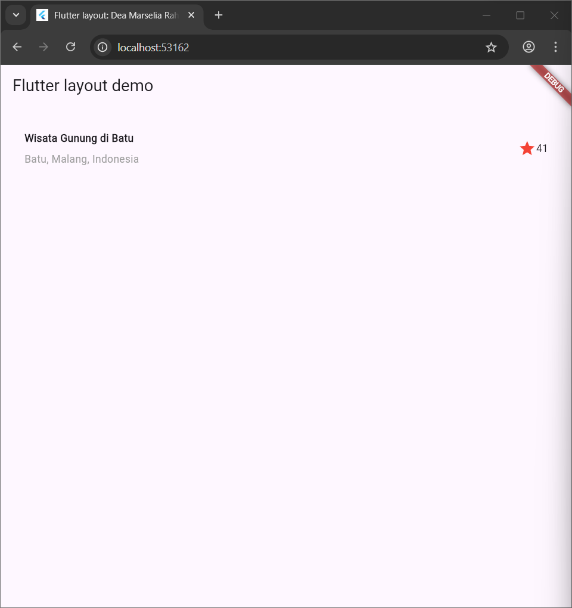
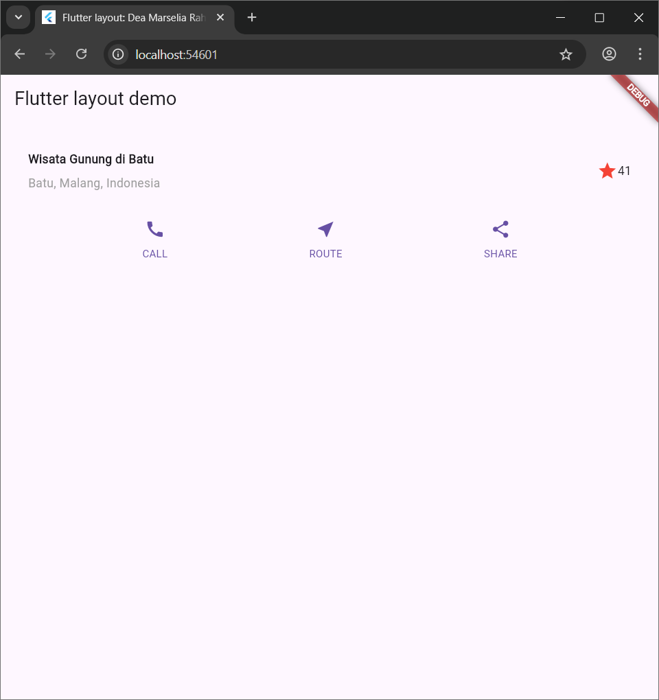
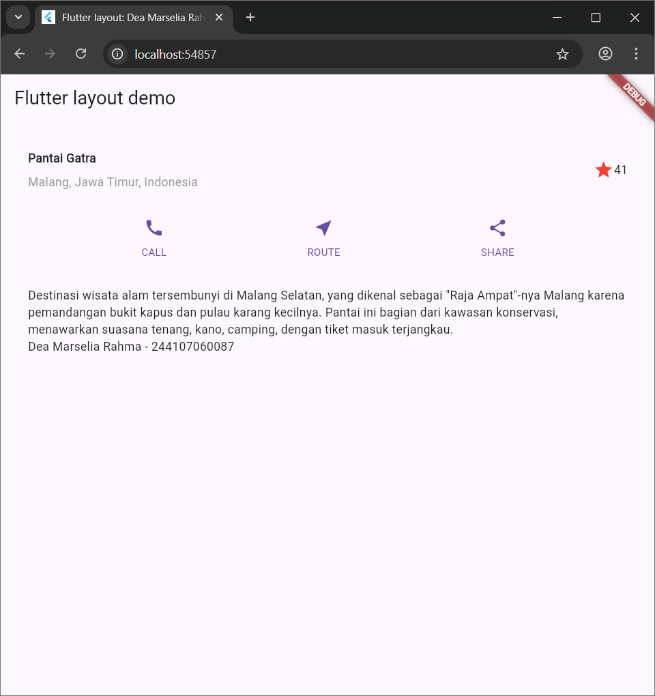
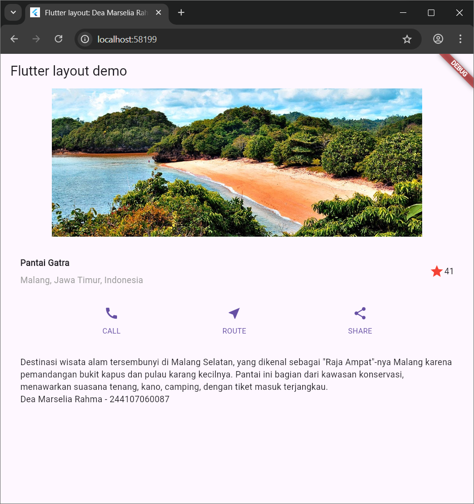

# 06 | Layout dan Navigasi

## Identitas Mahasiswa 

| Atribut | Nilai               |
| ------- | --------------------|
| Nama    | Dea Marselia Rahma  |
| NIM     | 244107060087        |
| Kelas   | SIB 2F              |

---

## Praktikum 1: Membangun Layout di Flutter

File `main.dart`
```
import 'package:flutter/material.dart';

void main() => runApp(const MyApp());

class MyApp extends StatelessWidget {
  const MyApp({super.key});

  @override
  Widget build(BuildContext context) {
    return MaterialApp(
      title: 'Flutter layout: Nama dan NIM Anda',
      home: Scaffold(
        appBar: AppBar(
          title: const Text('Flutter layout demo'),
        ),
        body: const Center(
          child: Text('Hello World'),
        ),
      ),
    );
  }
}
```
Class `MyApp`
```
    Widget titleSection = Container(
      padding: const EdgeInsets.all(32),
      child: Row(
        children: [
          Expanded(
            /* soal 1*/
            child: Column(
              crossAxisAlignment: CrossAxisAlignment.start,
              children: [
                /* soal 2*/
                Container(
                  padding: const EdgeInsets.only(bottom: 8),
                  child: const Text(
                    'Pantai Gatra',
                    style: TextStyle(
                      fontWeight: FontWeight.bold,
                    ),
                  ),
                ),
                Text(
                  'Malang, Jawa Timur, Indonesia',
                  style: TextStyle(color: Colors.grey),
                ),
              ],
            ),
          ),
          /* soal 3*/
          Icon(
          Icons.star,
            color: Colors.red,
          ),
          const Text('41'),
        ],
      ),
    );
```
return `MaterialApp` `body`
```
titleSection,
```


## Praktikum 2: Implementasi Button Row

Class `MyApp`
```
class MyApp extends StatelessWidget {
  const MyApp({super.key});

  @override
  Widget build(BuildContext context) {
    // ···
  }

  Column _buildButtonColumn(Color color, IconData icon, String label) {
    return Column(
      mainAxisSize: MainAxisSize.min,
      mainAxisAlignment: MainAxisAlignment.center,
      children: [
        Icon(icon, color: color),
        Container(
          margin: const EdgeInsets.only(top: 8),
          child: Text(
            label,
            style: TextStyle(
              fontSize: 12,
              fontWeight: FontWeight.w400,
              color: color,
            ),
          ),
        ),
      ],
    );
  }
}
```
Widget `buttonSection`
```
    Color color = Theme.of(context).primaryColor;

    Widget buttonSection = Row(
      mainAxisAlignment: MainAxisAlignment.spaceEvenly,
      children: [
        _buildButtonColumn(color, Icons.call, 'CALL'),
        _buildButtonColumn(color, Icons.near_me, 'ROUTE'),
        _buildButtonColumn(color, Icons.share, 'SHARE'),
      ],
    );
```
return `MaterialApp` `body`
```
buttonSection,
```


## Praktikum 3: Implementasi Text Section

Widget `textSection`
```
    Widget textSection = Container(
      padding: const EdgeInsets.all(32),
      child: const Text(
        'Destinasi wisata alam tersembunyi di Malang Selatan, yang dikenal sebagai "Raja Ampat"-nya Malang karena pemandangan bukit kapus dan pulau karang kecilnya. Pantai ini bagian dari kawasan konservasi, menawarkan suasana tenang, kano, camping, dengan tiket masuk terjangkau. \n'
        'Dea Marselia Rahma - 244107060087',
        softWrap: true,
      ),
    );
```
return `MaterialApp` `body`
```
textSection,
```


## Praktikum 4: Implementasi Image Section

File `pubspec.yaml`
```
flutter:
  uses-material-design: true
  assets:
    - images/gatra.jpg
```
return `MaterialApp` `body`
```
            Image.asset(
              'images/gatra.jpg',
              width: 600,
              height: 240,
              fit: BoxFit.cover,
            ),
```
```
body: ListView
```
