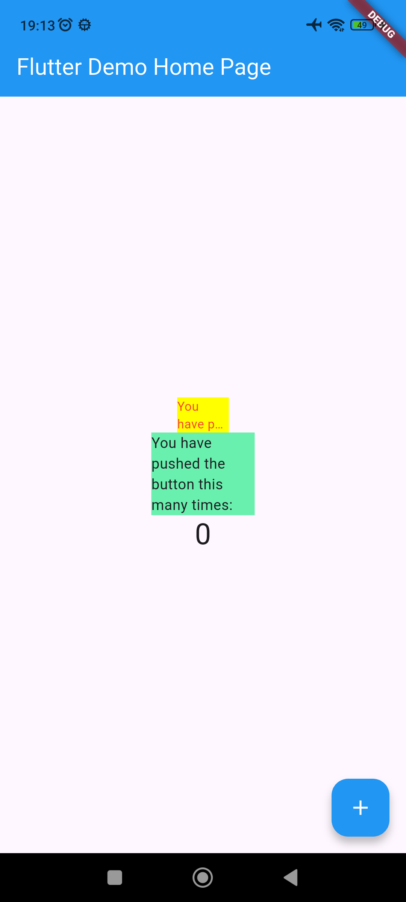

# 07 | Manajemen Plugin

## Identitas Mahasiswa 

| Atribut | Nilai               |
| ------- | --------------------|
| Nama    | Dea Marselia Rahma  |
| NIM     | 244107060087        |
| Kelas   | SIB 2F              |

---

## Menambahkan Plugin

Tambah plugin `auto_size_text` menggunakan perintah `flutter pub add auto_size_text` di terminal.

---

## File red_text_widget.dart
```
import 'package:flutter/material.dart';
import 'package:auto_size_text/auto_size_text.dart';

class RedTextWidget extends StatelessWidget {
  final String text;
  
  const RedTextWidget({Key? key, required this.text}) : super(key: key);

  @override
  Widget build(BuildContext context) {
    return AutoSizeText(
      text,
      style: const TextStyle(color: Colors.red, fontSize: 14),
      maxLines: 2,
      overflow: TextOverflow.ellipsis,
    );
  }
}
```
---

## File main.dart
```
import 'package:flutter/material.dart';
import 'red_text_widget.dart';

void main() {
  runApp(const MyApp());
}

class MyApp extends StatelessWidget {
  const MyApp({super.key});

  @override
  Widget build(BuildContext context) {
    return MaterialApp(
      title: 'Flutter Demo',
      theme: ThemeData(
        primarySwatch: Colors.blue,
      ),
      home: const MyHomePage(title: 'Flutter Demo Home Page'),
    );
  }
}

class MyHomePage extends StatefulWidget {
  const MyHomePage({super.key, required this.title});

  final String title;

  @override
  State<MyHomePage> createState() => _MyHomePageState();
}

class _MyHomePageState extends State<MyHomePage> {
  int _counter = 0;

  void _incrementCounter() {
    setState(() {
      _counter++;
    });
  }

  @override
  Widget build(BuildContext context) {
    return Scaffold(
      appBar: AppBar(
        backgroundColor: Colors.blue,
        foregroundColor: Colors.white,
        title: Text(widget.title),
      ),
      body: Center(
        child: Column(
          mainAxisAlignment: MainAxisAlignment.center,
          children: <Widget>[
            Container(
              color: Colors.yellowAccent,
              width: 50,
              child: const RedTextWidget(
                text: 'You have pushed the button this many times:',
              ),
            ),
            Container(
              color: Colors.greenAccent,
              width: 100,
              child: const Text(
                'You have pushed the button this many times:',
              ),
            ),
            Text(
              '$_counter',
              style: Theme.of(context).textTheme.headlineMedium,
            ),
          ],
        ),
      ),
      floatingActionButton: FloatingActionButton(
        onPressed: _incrementCounter,
        tooltip: 'Increment',
        backgroundColor: Colors.blue,
        foregroundColor: Colors.white,
        child: const Icon(Icons.add),
      ),
    );
  }
}
```
---

## Running Aplikasi

---

## Tugas

### Jelaskan maksud dari langkah 2 pada praktikum tersebut!

Langkah 2: Menambahkan Plugin

Menginstal library pihak ketiga ke dalam project. Dengan menjalankan perintah tersebut, Flutter otomatis mendaftarkan `auto_size_text` ke file `pubspec.yaml` agar fitur-fiturnya bisa digunakan dalam kode Dart.

### Jelaskan maksud dari langkah 5 pada praktikum tersebut!
Langkah 5: Membuat Variabel dan Constructor

Agar widget `RedTextWidget` bersifat dinamis. Dengan menambahkan variabel text di constructor, bisa mengirim isi tulisan yang berbeda-beda setiap kali widget ini dipanggil di bagian aplikasi yang lain.

### Pada langkah 6 terdapat dua widget yang ditambahkan, jelaskan fungsi dan perbedaannya!
Langkah 6: Perbedaan Dua Widget
1. Widget Pertama (`RedTextWidget`): Menggunakan plugin `auto_size_text`. Fungsinya untuk membuat teks secara otomatis menyesuaikan ukurannya agar pas dengan lebar Container yang hanya 50 unit, tanpa memaksakan ukuran asli yang besar.
2. Widget Kedua (`Text standar`): Menggunakan widget bawaan Flutter. Fungsinya hanya menampilkan teks biasa. Lebarnya dibatasi 100 unit tanpa fitur auto-size maka, teks ini akan langsung terpotong atau berantakan jika tidak muat.

### Jelaskan maksud dari tiap parameter yang ada di dalam plugin auto_size_text berdasarkan tautan pada dokumentasi ini !
- `text`: Isi string atau tulisan yang ingin ditampilkan di layar.
- `style`: Mengatur tampilan visual teks, seperti warna dan ukuran font dasar.
- `maxLines`: Membatasi jumlah baris maksimal. Jika teks terlalu panjang, tidak akan melebihi jumlah baris ini.
- `overflow`: Mengatur apa yang terjadi jika teks tetap tidak muat setelah ukurannya dikecilkan.