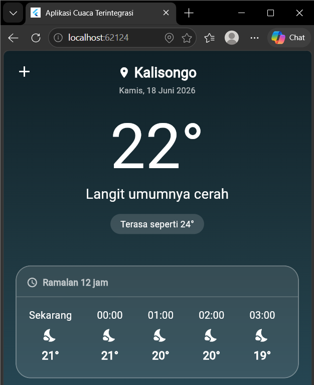
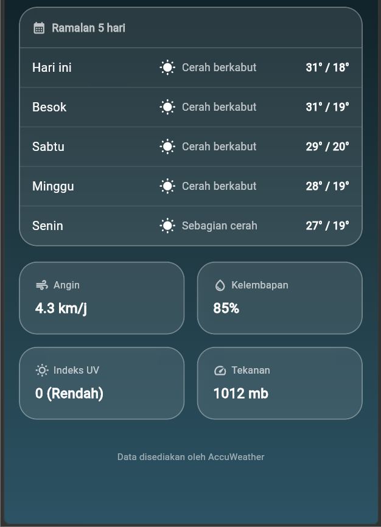
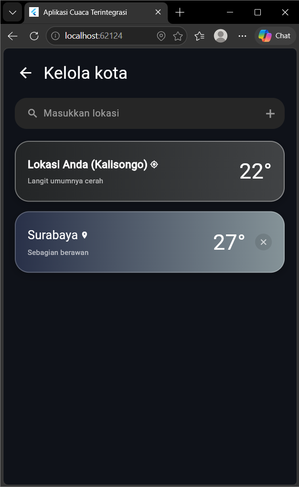

# 12 | Integrasi Aplikasi dengan API & Firebase

## Identitas Mahasiswa 

| Atribut | Nilai               |
| ------- | --------------------|
| Nama    | Dea Marselia Rahma  |
| NIM     | 244107060087        |
| Kelas   | SIB 2F              |

---

## main.dart
```
import 'package:flutter/material.dart';
import 'package:geolocator/geolocator.dart';
import 'package:http/http.dart' as http;
import 'dart:convert';
import 'accuweather_screen.dart';
import 'firebase_screen.dart';

void main() {
  runApp(const MainApp());
}

class MainApp extends StatelessWidget {
  const MainApp({super.key});

  @override
  Widget build(BuildContext context) {
    return MaterialApp(
      title: 'Aplikasi Cuaca Terintegrasi',
      debugShowCheckedModeBanner: false,
      theme: ThemeData(
        primarySwatch: Colors.blue,
        fontFamily: 'Roboto',
      ),
      home: const MainScreen(),
    );
  }
}

class MainScreen extends StatefulWidget {
  const MainScreen({super.key});
  
  static _MainScreenState of(BuildContext context) {
    return context.findAncestorStateOfType<_MainScreenState>()!;
  }

  @override
  State<MainScreen> createState() => _MainScreenState();
}

class _MainScreenState extends State<MainScreen> {
  // Posisi asli GPS pengguna (Malang sebagai nilai sementara saat loading)
  String gpsLocationKey = "202235";
  String gpsCityName = "Malang";

  // Kota yang sedang tampil di layar utama
  String locationKey = "202235";
  String cityName = "Mencari Lokasi...";
  bool isGpsLoaded = false;
  
  final String apiKey = "zpka_a13e2e492f654b98b712084623832ae6_89c3e275"; 

  @override
  void initState() {
    super.initState();
    _determinePosition();
  }

  Future<void> _determinePosition() async {
    bool serviceEnabled;
    LocationPermission permission;

    serviceEnabled = await Geolocator.isLocationServiceEnabled();
    if (!serviceEnabled) {
      _fallbackToDefault();
      return;
    }

    permission = await Geolocator.checkPermission();
    if (permission == LocationPermission.denied) {
      permission = await Geolocator.requestPermission();
      if (permission == LocationPermission.denied) {
        _fallbackToDefault();
        return;
      }
    }
    
    if (permission == LocationPermission.deniedForever) {
      _fallbackToDefault();
      return;
    } 

    try {
      Position position = await Geolocator.getCurrentPosition();
      await _fetchCityFromCoordinates(position.latitude, position.longitude);
    } catch (e) {
      _fallbackToDefault();
    }
  }

  Future<void> _fetchCityFromCoordinates(double lat, double lng) async {
    final url = Uri.parse("https://dataservice.accuweather.com/locations/v1/cities/geoposition/search?apikey=$apiKey&q=$lat,$lng&language=id-ID");
    try {
      final res = await http.get(url);
      if (res.statusCode == 200) {
        final data = json.decode(res.body);
        setState(() {
          gpsLocationKey = data['Key'];
          gpsCityName = data['LocalizedName'];
          locationKey = data['Key'];
          cityName = data['LocalizedName'];
          isGpsLoaded = true;
        });
      } else {
        _fallbackToDefault();
      }
    } catch (e) {
      _fallbackToDefault();
    }
  }

  void _fallbackToDefault() {
    setState(() {
      gpsLocationKey = "202235";
      gpsCityName = "Malang";
      locationKey = "202235";
      cityName = "Malang";
      isGpsLoaded = true;
    });
  }

  void setLocation(String key, String name) {
    setState(() {
      locationKey = key;
      cityName = name;
    });
  }

  @override
  Widget build(BuildContext context) {
    if (!isGpsLoaded) {
      return const Scaffold(
        backgroundColor: Colors.black,
        body: Center(
          child: Column(
            mainAxisAlignment: MainAxisAlignment.center,
            children: [
              CircularProgressIndicator(color: Colors.white),
              SizedBox(height: 16),
              Text("Melacak Lokasi Anda...", style: TextStyle(color: Colors.white, fontSize: 16)),
            ],
          ),
        ),
      );
    }

    return Scaffold(
      backgroundColor: Colors.black,
      body: AccuWeatherScreen(
        locationKey: locationKey, 
        cityName: cityName,
        gpsLocationKey: gpsLocationKey,
        gpsCityName: gpsCityName,
        onCitySelected: setLocation,
      ),
    );
  }
}
```
---

## firebase_screen.dart
```
import 'dart:convert';
import 'package:flutter/material.dart';
import 'package:http/http.dart' as http;

class FirebaseScreen extends StatefulWidget {
  final Function(String, String) onCitySelected;
  final String defaultLocationKey;
  final String defaultCityName;

  const FirebaseScreen({
    super.key, 
    required this.onCitySelected,
    required this.defaultLocationKey,
    required this.defaultCityName,
  });

  @override
  State<FirebaseScreen> createState() => _FirebaseScreenState();
}

class _FirebaseScreenState extends State<FirebaseScreen> {
  final String firebaseUrl = "https://flutter-api-app-951e9-default-rtdb.asia-southeast1.firebasedatabase.app"; 
  final String apiKey = "zpka_a13e2e492f654b98b712084623832ae6_89c3e275"; 

  List<Map<String, dynamic>> cities = [];
  late Map<String, dynamic> defaultLocation;
  
  bool isLoading = true;
  bool isAdding = false;
  final TextEditingController _cityController = TextEditingController();

  @override
  void initState() {
    super.initState();
    defaultLocation = {
      'id': 'default',
      'text': 'Lokasi Anda (${widget.defaultCityName})',
      'locationKey': widget.defaultLocationKey,
      'temp': '--',
      'weatherText': 'Mengambil data...',
      'isDefault': true,
    };
    fetchCities();
  }

  Future<void> fetchCities() async {
    setState(() {
      isLoading = true;
    });

    final url = Uri.parse("$firebaseUrl/notes.json"); 
    try {
      final response = await http.get(url);
      if (response.statusCode == 200 && response.body != "null") {
        final data = json.decode(response.body) as Map<String, dynamic>;
        final List<Map<String, dynamic>> loadedCities = [];
        data.forEach((key, value) {
          loadedCities.add({
            'id': key,
            'text': value['text'] ?? "Unknown",
            'locationKey': value['locationKey'] ?? "202235",
            'temp': "--",
            'weatherText': "Mengambil data...",
            'isDefault': false,
          });
        });
        setState(() {
          cities = loadedCities;
          isLoading = false;
        });
        
        _fetchTemperatures();
      } else {
        setState(() {
          cities = [];
          isLoading = false;
        });
        _fetchTemperatures(); // Tetap fetch suhu untuk default location
      }
    } catch (error) {
      setState(() {
        isLoading = false;
      });
      _fetchTemperatures(); // Tetap fetch suhu untuk default location
      ScaffoldMessenger.of(context).showSnackBar(SnackBar(content: Text("Error memuat kota: $error")));
    }
  }

  Future<void> _fetchTemperatures() async {
    // Ambil suhu lokasi pengguna lebih dulu
    _fetchSingleTemp(defaultLocation, (updated) {
      if (mounted) setState(() { defaultLocation = updated; });
    });

    for (int i = 0; i < cities.length; i++) {
      if (!mounted) return;
      _fetchSingleTemp(cities[i], (updated) {
        if (mounted) setState(() { cities[i] = updated; });
      });
    }
  }

  Future<void> _fetchSingleTemp(Map<String, dynamic> city, Function(Map<String, dynamic>) onUpdate) async {
    final locKey = city['locationKey'];
    final url = Uri.parse("https://dataservice.accuweather.com/currentconditions/v1/$locKey?apikey=$apiKey&language=id-ID");
    try {
      final res = await http.get(url);
      if (res.statusCode == 200) {
        final cData = json.decode(res.body);
        if (cData.isNotEmpty) {
          city['temp'] = "${cData[0]['Temperature']['Metric']['Value'].round()}°";
          city['weatherText'] = cData[0]['WeatherText'] ?? "";
          onUpdate(city);
        }
      }
    } catch (e) {}
  }

  Future<void> addCity(String query) async {
    if (query.trim().isEmpty) {
      ScaffoldMessenger.of(context).showSnackBar(const SnackBar(content: Text("Nama kota tidak boleh kosong!")));
      return;
    }
    setState(() {
      isAdding = true;
    });

    // 1. Cari Location Key di AccuWeather
    final searchUrl = Uri.parse("https://dataservice.accuweather.com/locations/v1/cities/search?apikey=$apiKey&q=${query.trim()}&language=id-ID");
    try {
      final searchRes = await http.get(searchUrl);
      if (searchRes.statusCode == 200) {
        final searchData = json.decode(searchRes.body) as List<dynamic>;
        if (searchData.isNotEmpty) {
          final locKey = searchData[0]['Key'];
          final localizedName = searchData[0]['LocalizedName'];

          // 2. Simpan ke Firebase
          final fbUrl = Uri.parse("$firebaseUrl/notes.json");
          final res = await http.post(
            fbUrl,
            body: json.encode({
              'text': localizedName,
              'locationKey': locKey,
              'timestamp': DateTime.now().toIso8601String(),
            }),
          );

          if (res.statusCode == 200) {
            _cityController.clear();
            await fetchCities();
          }
        } else {
          ScaffoldMessenger.of(context).showSnackBar(const SnackBar(content: Text("Kota tidak ditemukan di server AccuWeather.")));
        }
      }
    } catch (error) {
      ScaffoldMessenger.of(context).showSnackBar(SnackBar(content: Text("Error: $error")));
    }

    setState(() {
      isAdding = false;
    });
  }

  Future<void> deleteCity(String id) async {
    final url = Uri.parse("$firebaseUrl/notes/$id.json");
    try {
      final response = await http.delete(url);
      if (response.statusCode == 200) {
        fetchCities();
      }
    } catch (error) {
      ScaffoldMessenger.of(context).showSnackBar(SnackBar(content: Text("Error menghapus kota: $error")));
    }
  }

  List<Color> _getDynamicBackground() {
    final hour = DateTime.now().hour;
    if (hour >= 6 && hour < 18) {
      return [const Color(0xFF2193b0), const Color(0xFF6dd5ed)]; // Siang
    } else {
      return [const Color(0xFF0F2027), const Color(0xFF203A43)]; // Malam
    }
  }

  @override
  Widget build(BuildContext context) {
    return Container(
      decoration: BoxDecoration(
        gradient: LinearGradient(
          begin: Alignment.topCenter,
          end: Alignment.bottomCenter,
          colors: _getDynamicBackground(),
        ),
      ),
      child: Scaffold(
        backgroundColor: Colors.transparent,
        body: SafeArea(
        child: Column(
          children: [
          // Header / Info
          Container(
            padding: const EdgeInsets.fromLTRB(16, 20, 24, 20),
            alignment: Alignment.centerLeft,
            child: Row(
              children: [
                IconButton(
                  icon: const Icon(Icons.arrow_back, color: Colors.white, size: 28),
                  onPressed: () => Navigator.pop(context),
                ),
                const SizedBox(width: 8),
                const Expanded(
                  child: Text(
                    "Kelola kota",
                    style: TextStyle(
                      fontSize: 28,
                      fontWeight: FontWeight.w400,
                      color: Colors.white,
                    ),
                  ),
                ),
              ],
            ),
          ),
          
          // Input Field
          Padding(
            padding: const EdgeInsets.symmetric(horizontal: 20, vertical: 0),
            child: Container(
              padding: const EdgeInsets.symmetric(horizontal: 4, vertical: 2),
              decoration: BoxDecoration(
                color: const Color(0xFF262626),
                borderRadius: BorderRadius.circular(20),
              ),
              child: Row(
                children: [
                  const SizedBox(width: 16),
                  const Icon(Icons.search, color: Colors.white54, size: 20),
                  const SizedBox(width: 8),
                  Expanded(
                    child: TextField(
                      controller: _cityController,
                      style: const TextStyle(color: Colors.white),
                      decoration: const InputDecoration(
                        hintText: "Masukkan lokasi",
                        hintStyle: TextStyle(color: Colors.white54),
                        border: InputBorder.none,
                      ),
                      onSubmitted: (val) {
                        if (!isAdding) addCity(val);
                      },
                    ),
                  ),
                  if (isAdding)
                    const Padding(
                      padding: EdgeInsets.only(right: 16.0),
                      child: SizedBox(width: 16, height: 16, child: CircularProgressIndicator(color: Colors.white54, strokeWidth: 2)),
                    )
                  else
                    IconButton(
                      icon: const Icon(Icons.add, color: Colors.white54),
                      onPressed: () => addCity(_cityController.text),
                    ),
                ],
              ),
            ),
          ),
          const SizedBox(height: 20),
          
          // List Kota
          Expanded(
            child: isLoading
                ? const Center(child: CircularProgressIndicator(color: Colors.white54))
                : ListView.builder(
                    padding: const EdgeInsets.symmetric(horizontal: 20),
                    itemCount: cities.length + 1, // +1 for default location
                    itemBuilder: (context, index) {
                      final city = index == 0 ? defaultLocation : cities[index - 1];
                      final isDefault = city['isDefault'] == true;

                      return GestureDetector(
                        onTap: () {
                          widget.onCitySelected(city['locationKey'], city['text'].toString().replaceAll("Lokasi Anda (", "").replaceAll(")", ""));
                          Navigator.pop(context);
                        },
                        child: Container(
                          margin: const EdgeInsets.only(bottom: 16),
                          padding: const EdgeInsets.symmetric(horizontal: 20, vertical: 24),
                          decoration: BoxDecoration(
                            gradient: isDefault 
                                ? const LinearGradient(colors: [Color(0xFF232526), Color(0xFF414345)]) 
                                : const LinearGradient(colors: [Color(0xFF283048), Color(0xFF859398)]),
                            borderRadius: BorderRadius.circular(24),
                            border: Border.all(color: isDefault ? Colors.white38 : Colors.white24, width: 1.5),
                            boxShadow: const [BoxShadow(color: Colors.black26, blurRadius: 12, offset: Offset(0, 4))],
                          ),
                          child: Row(
                            mainAxisAlignment: MainAxisAlignment.spaceBetween,
                            children: [
                              Column(
                                crossAxisAlignment: CrossAxisAlignment.start,
                                children: [
                                  Row(
                                    children: [
                                      Text(
                                        city['text'],
                                        style: TextStyle(
                                          fontSize: isDefault ? 18 : 20,
                                          fontWeight: isDefault ? FontWeight.bold : FontWeight.w500,
                                          color: Colors.white,
                                        ),
                                      ),
                                      const SizedBox(width: 4),
                                      Icon(isDefault ? Icons.my_location : Icons.location_on, color: Colors.white, size: 14),
                                    ],
                                  ),
                                  const SizedBox(height: 6),
                                  Text(
                                    city['weatherText'] ?? "Memuat...",
                                    style: const TextStyle(color: Colors.white70, fontSize: 12),
                                  ),
                                ],
                              ),
                              Row(
                                children: [
                                  Text(
                                    city['temp'],
                                    style: const TextStyle(
                                      color: Colors.white,
                                      fontSize: 36,
                                      fontWeight: FontWeight.w300,
                                    ),
                                  ),
                                  if (!isDefault) ...[
                                    const SizedBox(width: 16),
                                    GestureDetector(
                                      onTap: () => deleteCity(city['id']),
                                      child: Container(
                                        padding: const EdgeInsets.all(6),
                                        decoration: BoxDecoration(
                                          color: Colors.black.withOpacity(0.1),
                                          shape: BoxShape.circle,
                                        ),
                                        child: const Icon(Icons.close, color: Colors.white70, size: 16),
                                      ),
                                    ),
                                  ],
                                ],
                              ),
                            ],
                          ),
                        ),
                      );
                    },
                  ),
          ),
        ],
      )),
    );
  }
}
```
---

## accuweather_screen.dart
```
import 'dart:convert';
import 'dart:ui';
import 'package:flutter/material.dart';
import 'package:http/http.dart' as http;
import 'firebase_screen.dart';

class AccuWeatherScreen extends StatefulWidget {
  final String locationKey;
  final String cityName;
  final String gpsLocationKey;
  final String gpsCityName;
  final Function(String, String) onCitySelected;

  const AccuWeatherScreen({
    super.key, 
    required this.locationKey, 
    required this.cityName, 
    required this.gpsLocationKey,
    required this.gpsCityName,
    required this.onCitySelected
  });

  @override
  State<AccuWeatherScreen> createState() => _AccuWeatherScreenState();
}

class _AccuWeatherScreenState extends State<AccuWeatherScreen> {
  final String apiKey = "zpka_a13e2e492f654b98b712084623832ae6_89c3e275"; 
  
  bool isLoading = true;
  String errorMessage = "";

  // Data Cuaca Saat Ini
  String temperature = "--";
  String weatherText = "Memuat data...";
  int weatherIcon = 1;
  String realFeel = "--";
  String humidity = "--";
  String windSpeed = "--";
  String uvIndex = "--";
  String pressure = "--";

  // Data Ramalan Cuaca
  List<dynamic> hourlyForecast = [];
  List<dynamic> dailyForecast = [];

  @override
  void initState() {
    super.initState();
    fetchAllData();
  }

  @override
  void didUpdateWidget(AccuWeatherScreen oldWidget) {
    super.didUpdateWidget(oldWidget);
    if (oldWidget.locationKey != widget.locationKey) {
      fetchAllData();
    }
  }

  Future<void> fetchAllData() async {
    setState(() {
      isLoading = true;
      errorMessage = "";
    });
    
    final currentUrl = Uri.parse("https://dataservice.accuweather.com/currentconditions/v1/${widget.locationKey}?apikey=$apiKey&language=id-ID&details=true");
    final hourlyUrl = Uri.parse("https://dataservice.accuweather.com/forecasts/v1/hourly/12hour/${widget.locationKey}?apikey=$apiKey&language=id-ID&metric=true");
    final dailyUrl = Uri.parse("https://dataservice.accuweather.com/forecasts/v1/daily/5day/${widget.locationKey}?apikey=$apiKey&language=id-ID&metric=true");

    try {
      final currentRes = await http.get(currentUrl);
      final hourlyRes = await http.get(hourlyUrl);
      final dailyRes = await http.get(dailyUrl);

      if (currentRes.statusCode == 200 && hourlyRes.statusCode == 200 && dailyRes.statusCode == 200) {
        final currentData = json.decode(currentRes.body);
        final hourlyData = json.decode(hourlyRes.body);
        final dailyData = json.decode(dailyRes.body);

        if (currentData.isNotEmpty) {
          final c = currentData[0];
          temperature = "${c['Temperature']['Metric']['Value'].round()}";
          weatherText = c['WeatherText'];
          weatherIcon = c['WeatherIcon'] ?? 1;
          realFeel = "${c['RealFeelTemperature']['Metric']['Value'].round()}°";
          humidity = "${c['RelativeHumidity']}%";
          windSpeed = "${c['Wind']['Speed']['Metric']['Value']} km/j";
          uvIndex = "${c['UVIndex']} (${c['UVIndexText']})";
          pressure = "${c['Pressure']['Metric']['Value']} mb";
        }

        hourlyForecast = hourlyData;
        dailyForecast = dailyData['DailyForecasts'];

        setState(() {
          isLoading = false;
        });
      } else {
        setState(() {
          isLoading = false;
          errorMessage = "Gagal mengambil data dari server.";
        });
      }
    } catch (e) {
      setState(() {
        isLoading = false;
        errorMessage = "Gagal memuat. Pastikan Anda terkoneksi ke internet.\n\nDetail: $e";
      });
    }
  }

  IconData _getWeatherIcon(int iconCode) {
    if (iconCode >= 1 && iconCode <= 5) return Icons.wb_sunny_rounded; 
    if (iconCode >= 6 && iconCode <= 11) return Icons.cloud_rounded; 
    if (iconCode >= 12 && iconCode <= 18) return Icons.water_drop_rounded; 
    if (iconCode >= 19 && iconCode <= 29) return Icons.ac_unit_rounded; 
    if (iconCode >= 30 && iconCode <= 44) return Icons.nights_stay_rounded; 
    return Icons.cloud_queue_rounded;
  }

  List<Color> _getWeatherBackground(int iconCode) {
    bool isNight = (iconCode >= 33 && iconCode <= 44);
    if (isNight) {
      return [const Color(0xFF0F2027), const Color(0xFF203A43), const Color(0xFF2C5364)];
    }
    if (iconCode >= 1 && iconCode <= 5) return [const Color(0xFF2193b0), const Color(0xFF6dd5ed)];
    if (iconCode >= 6 && iconCode <= 11) return [const Color(0xFFbdc3c7), const Color(0xFF2c3e50)];
    if (iconCode >= 12 && iconCode <= 18) return [const Color(0xFF1488CC), const Color(0xFF2B32B2)];
    return [const Color(0xFF2193b0), const Color(0xFF6dd5ed)]; 
  }

  String _formatTime(String isoTime) {
    // Ambil string jam langsung dari API, abaikan timezone emulator/perangkat
    if (isoTime.contains('T')) {
      return isoTime.split('T')[1].substring(0, 5);
    }
    return isoTime;
  }

  String _getDayName(String isoTime) {
    final dt = DateTime.parse(isoTime);
    final today = DateTime.now();
    if (dt.day == today.day && dt.month == today.month) return "Hari ini";
    if (dt.day == today.add(const Duration(days: 1)).day) return "Besok";
    
    switch (dt.weekday) {
      case 1: return "Senin";
      case 2: return "Selasa";
      case 3: return "Rabu";
      case 4: return "Kamis";
      case 5: return "Jumat";
      case 6: return "Sabtu";
      case 7: return "Minggu";
      default: return "";
    }
  }

  String _getCurrentDateString() {
    final now = DateTime.now();
    final List<String> months = ["Januari", "Februari", "Maret", "April", "Mei", "Juni", "Juli", "Agustus", "September", "Oktober", "November", "Desember"];
    final List<String> days = ["Senin", "Selasa", "Rabu", "Kamis", "Jumat", "Sabtu", "Minggu"];
    return "${days[now.weekday - 1]}, ${now.day} ${months[now.month - 1]} ${now.year}";
  }

  Widget _buildGlassCard({required Widget child, EdgeInsetsGeometry? padding}) {
    return ClipRRect(
      borderRadius: BorderRadius.circular(24),
      child: BackdropFilter(
        filter: ImageFilter.blur(sigmaX: 15, sigmaY: 15),
        child: Container(
          padding: padding ?? const EdgeInsets.all(16),
          decoration: BoxDecoration(
            color: Colors.white.withOpacity(0.1),
            borderRadius: BorderRadius.circular(24),
            border: Border.all(color: Colors.white.withOpacity(0.3), width: 1.5),
          ),
          child: child,
        ),
      ),
    );
  }

  Widget _buildDetailItem(IconData icon, String title, String value) {
    return Column(
      crossAxisAlignment: CrossAxisAlignment.start,
      mainAxisAlignment: MainAxisAlignment.center,
      children: [
        Row(
          children: [
            Icon(icon, color: Colors.white70, size: 18),
            const SizedBox(width: 6),
            Text(title, style: const TextStyle(color: Colors.white70, fontSize: 13)),
          ],
        ),
        const SizedBox(height: 8),
        Text(value, style: const TextStyle(color: Colors.white, fontSize: 18, fontWeight: FontWeight.w600)),
      ],
    );
  }

  @override
  Widget build(BuildContext context) {
    final bgColors = _getWeatherBackground(weatherIcon);
    
    return Container(
      width: double.infinity,
      decoration: BoxDecoration(
        gradient: LinearGradient(colors: bgColors, begin: Alignment.topCenter, end: Alignment.bottomCenter),
      ),
      child: Scaffold(
        backgroundColor: Colors.transparent,
        body: isLoading 
          ? const Center(child: CircularProgressIndicator(color: Colors.white))
          : errorMessage.isNotEmpty
            ? Center(child: Text(errorMessage, style: const TextStyle(color: Colors.white)))
            : RefreshIndicator(
                onRefresh: fetchAllData,
                color: Colors.blueAccent,
                child: SingleChildScrollView(
                  physics: const AlwaysScrollableScrollPhysics(parent: BouncingScrollPhysics()),
                  child: Padding(
                    padding: const EdgeInsets.symmetric(horizontal: 20, vertical: 20),
                    child: SafeArea(
                      child: Column(
                        children: [
                          // 1. Lokasi & Refresh
                          Row(
                            mainAxisAlignment: MainAxisAlignment.spaceBetween,
                            crossAxisAlignment: CrossAxisAlignment.start,
                            children: [
                              IconButton(
                                icon: const Icon(Icons.add, color: Colors.white, size: 28),
                                onPressed: () {
                                  Navigator.push(
                                    context,
                                    MaterialPageRoute(
                                      builder: (context) => FirebaseScreen(
                                        onCitySelected: widget.onCitySelected,
                                        defaultLocationKey: widget.gpsLocationKey,
                                        defaultCityName: widget.gpsCityName,
                                      ),
                                    ),
                                  );
                                },
                                padding: EdgeInsets.zero,
                                constraints: const BoxConstraints(),
                              ),
                              Column(
                                children: [
                                  Row(
                                    children: [
                                      const Icon(Icons.location_on, color: Colors.white, size: 20),
                                      const SizedBox(width: 6),
                                      Text(widget.cityName, style: const TextStyle(fontSize: 22, fontWeight: FontWeight.bold, color: Colors.white)),
                                    ],
                                  ),
                                  const SizedBox(height: 4),
                                  Text(_getCurrentDateString(), style: const TextStyle(color: Colors.white70, fontSize: 13, fontWeight: FontWeight.w500)),
                                ],
                              ),
                              const SizedBox(width: 28),
                            ],
                          ),
                          const SizedBox(height: 30),

                          // 2. Header Suhu Besar
                          Text(
                            "$temperature°",
                            style: const TextStyle(fontSize: 100, fontWeight: FontWeight.w300, color: Colors.white, height: 1.0),
                          ),
                          const SizedBox(height: 10),
                          Text(
                            weatherText,
                            style: const TextStyle(fontSize: 22, color: Colors.white, fontWeight: FontWeight.w500),
                          ),
                          const SizedBox(height: 16),
                          Container(
                            padding: const EdgeInsets.symmetric(horizontal: 16, vertical: 6),
                            decoration: BoxDecoration(
                              color: Colors.white.withOpacity(0.15),
                              borderRadius: BorderRadius.circular(20),
                            ),
                            child: Text("Terasa seperti $realFeel", style: const TextStyle(color: Colors.white, fontSize: 14)),
                          ),
                          const SizedBox(height: 50),
                          
                          // 3. Ramalan 12 Jam (Hourly)
                          if (hourlyForecast.isNotEmpty)
                            _buildGlassCard(
                              padding: const EdgeInsets.symmetric(vertical: 16),
                              child: Column(
                                crossAxisAlignment: CrossAxisAlignment.start,
                                children: [
                                  const Padding(
                                    padding: EdgeInsets.only(left: 16, bottom: 12),
                                    child: Row(
                                      children: [
                                        Icon(Icons.access_time, color: Colors.white70, size: 18),
                                        SizedBox(width: 8),
                                        Text("Ramalan 12 jam", style: TextStyle(color: Colors.white70, fontWeight: FontWeight.w600)),
                                      ],
                                    ),
                                  ),
                                  const Divider(color: Colors.white24, height: 1),
                                  const SizedBox(height: 12),
                                  SizedBox(
                                    height: 100,
                                    child: ListView.builder(
                                      scrollDirection: Axis.horizontal,
                                      itemCount: hourlyForecast.length,
                                      itemBuilder: (context, index) {
                                        final hour = hourlyForecast[index];
                                        return Padding(
                                          padding: const EdgeInsets.symmetric(horizontal: 20),
                                          child: Column(
                                            mainAxisAlignment: MainAxisAlignment.center,
                                            children: [
                                              Text(
                                                index == 0 ? "Sekarang" : "${(DateTime.now().hour + index) % 24}".padLeft(2, '0') + ":00", 
                                                style: const TextStyle(color: Colors.white, fontSize: 16)
                                              ),
                                              const SizedBox(height: 8),
                                              Icon(_getWeatherIcon(hour['WeatherIcon']), color: Colors.white, size: 24),
                                              const SizedBox(height: 8),
                                              Text("${hour['Temperature']['Value'].round()}°", style: const TextStyle(color: Colors.white, fontWeight: FontWeight.bold, fontSize: 18)),
                                            ],
                                          ),
                                        );
                                      },
                                    ),
                                  ),
                                ],
                              ),
                            ),
                          const SizedBox(height: 20),

                          // 4. Ramalan 5 Hari (Daily)
                          if (dailyForecast.isNotEmpty)
                            _buildGlassCard(
                              padding: const EdgeInsets.all(0),
                              child: Column(
                                crossAxisAlignment: CrossAxisAlignment.start,
                                children: [
                                  const Padding(
                                    padding: EdgeInsets.all(16),
                                    child: Row(
                                      children: [
                                        Icon(Icons.calendar_month, color: Colors.white70, size: 18),
                                        SizedBox(width: 8),
                                        Text("Ramalan 5 hari", style: TextStyle(color: Colors.white70, fontWeight: FontWeight.w600)),
                                      ],
                                    ),
                                  ),
                                  const Divider(color: Colors.white24, height: 1),
                                  ListView.separated(
                                    shrinkWrap: true,
                                    physics: const NeverScrollableScrollPhysics(),
                                    itemCount: dailyForecast.length,
                                    separatorBuilder: (context, index) => const Divider(color: Colors.white12, height: 1),
                                    itemBuilder: (context, index) {
                                      final day = dailyForecast[index];
                                      return Padding(
                                        padding: const EdgeInsets.symmetric(horizontal: 16, vertical: 14),
                                        child: Row(
                                          mainAxisAlignment: MainAxisAlignment.spaceBetween,
                                          children: [
                                            Expanded(
                                              flex: 2,
                                              child: Text(_getDayName(day['Date']), style: const TextStyle(color: Colors.white, fontSize: 16, fontWeight: FontWeight.w500)),
                                            ),
                                            Expanded(
                                              flex: 2,
                                              child: Row(
                                                children: [
                                                  Icon(_getWeatherIcon(day['Day']['Icon']), color: Colors.white, size: 22),
                                                  const SizedBox(width: 8),
                                                  Expanded(child: Text(day['Day']['IconPhrase'], style: const TextStyle(color: Colors.white70, fontSize: 14), overflow: TextOverflow.ellipsis)),
                                                ],
                                              ),
                                            ),
                                            Expanded(
                                              flex: 1,
                                              child: Text(
                                                "${day['Temperature']['Maximum']['Value'].round()}° / ${day['Temperature']['Minimum']['Value'].round()}°",
                                                textAlign: TextAlign.right,
                                                style: const TextStyle(color: Colors.white, fontWeight: FontWeight.bold),
                                              ),
                                            ),
                                          ],
                                        ),
                                      );
                                    },
                                  ),
                                ],
                              ),
                            ),
                          const SizedBox(height: 20),

                          // 5. Grid Detail Cuaca (Angin, Kelembapan, UV, Tekanan)
                          Row(
                            children: [
                              Expanded(
                                child: _buildGlassCard(
                                  padding: const EdgeInsets.all(20),
                                  child: _buildDetailItem(Icons.air, "Angin", windSpeed),
                                ),
                              ),
                              const SizedBox(width: 16),
                              Expanded(
                                child: _buildGlassCard(
                                  padding: const EdgeInsets.all(20),
                                  child: _buildDetailItem(Icons.water_drop_outlined, "Kelembapan", humidity),
                                ),
                              ),
                            ],
                          ),
                          const SizedBox(height: 16),
                          Row(
                            children: [
                              Expanded(
                                child: _buildGlassCard(
                                  padding: const EdgeInsets.all(20),
                                  child: _buildDetailItem(Icons.wb_sunny_outlined, "Indeks UV", uvIndex),
                                ),
                              ),
                              const SizedBox(width: 16),
                              Expanded(
                                child: _buildGlassCard(
                                  padding: const EdgeInsets.all(20),
                                  child: _buildDetailItem(Icons.speed, "Tekanan", pressure),
                                ),
                              ),
                            ],
                          ),
                          const SizedBox(height: 40),
                          const Text("Data disediakan oleh AccuWeather", style: TextStyle(color: Colors.white54, fontSize: 12)),
                          const SizedBox(height: 60),
                        ],
                      ),
                    ),
                  ),
                ),
              ),
      ),
    );
  }
}
```
---

## AndroidManifest.xml
```
    <uses-permission android:name="android.permission.ACCESS_FINE_LOCATION" />
    <uses-permission android:name="android.permission.ACCESS_COARSE_LOCATION" />
```

## Hasil Running



---